# Francisco Sanabria

<!-- incremental_lists: false -->

- 10 años de experiencia
- IBM: Cloud Engineer
- Datasite: Site Reliability Engineer
- Opensource ❤️
- Professional Nerd
  - Homelab
  - Visual Artist

### Contacto

- linkedin.com/in/fcosanabria
- github.com/fcosanabria
- instagram.com/digital.death.disrupt

<!-- end_slide -->

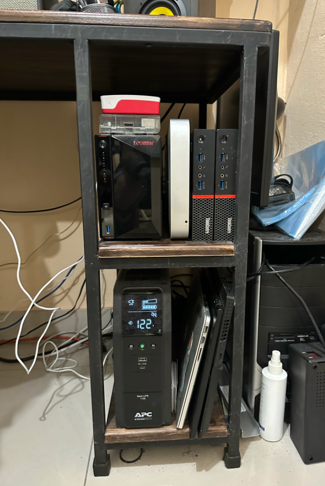

- Thinkclient M900
- Mac Mini 2012
- Asustor NAS
- RaspberryPi x2

<!-- end_slide -->

<!-- end_slide -->

# Recursos

- Ghostty Terminal + iTerm for gif support
- Neovim + Kickstart + LazyVim
- Tmux
- Berkeley Mono
- Presenterm
- Mermaid CLI

<!-- pause -->

> Todo esto puede encontrarse en mis dotfiles repo.
>
> github.com/fcosanabria/dotfiles.git

<!-- end_slide -->

# SRE: Site Reliability Engineering

- Observalibity
- Infrastructure
- Provide Tools
- Helps people

<!-- end_slide -->

# The Revolution of the Cloud

Hay una revolución que está sucediendo ahora mismo

- Creación de la nube
- El nacimiento de DevOps
- La creación de los contenedores

> Estas olas están creando un nuevo mundo de Software

<!-- speaker_note: El sistema operativo de nuestro nuevo mundo es Kubernetes -->
<!-- end_slide -->

# Historia

- Tour de historia rápido
- ¿Porqué Kubernetes es tan valioso?

<!-- speaker_note: |
  Kelsey Hightower es una leyenda en la comunidad de Kubernetes y ademas staff developer
  en Google, dice que Kubernetes provee absolutamente todo lo que un administrador de
  sistemas necesita para trabajar.
  - Automatizacion
  - Monitoreo
  - Sistemas de Contingencia
  - Logs centralizados y mucho más.
  > Es basicamente todo lo que la comunidad de DevOps ha aprendido durante todos estos años.
  > Y hacerlo por defecto listo para su uso.
-->
<!-- end_slide -->

# CLOUD NATIVE

## Nativo de la nube

- Automatizable
- Ubicuo y Flexible
- Resiliente y Escalable
- Dinámico
- Observable
- Distribuido

<!-- speaker_note: |
Ubicuo, es basicamente omnipresente.
Pronto vamos a entender esta parte, precisamente gracias a los conceptos
-->
<!-- end_slide -->

# Deployments

## Tradicional vs Contenedores vs Kubernetes

### Tradicional

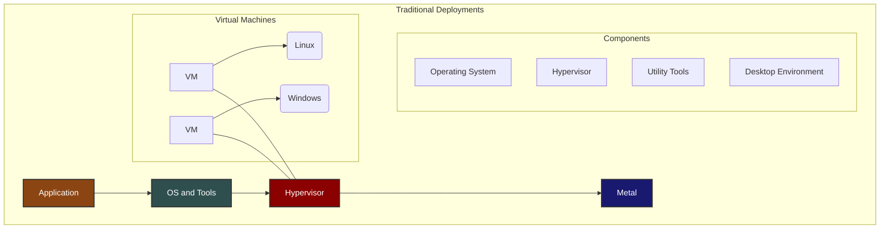

<!-- end_slide -->

# Deployments

## Contenedores

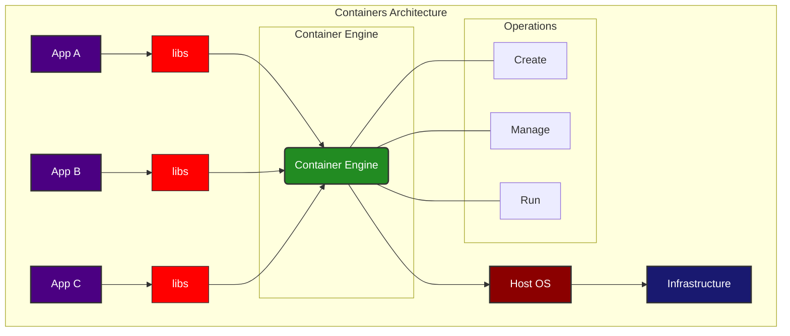

<!-- end_slide -->

<!-- jump_to_middle -->
<!-- alignment: center -->

¡Todo se trata de imágenes!

<!-- end_slide -->

# Deployments + ¿porqué?

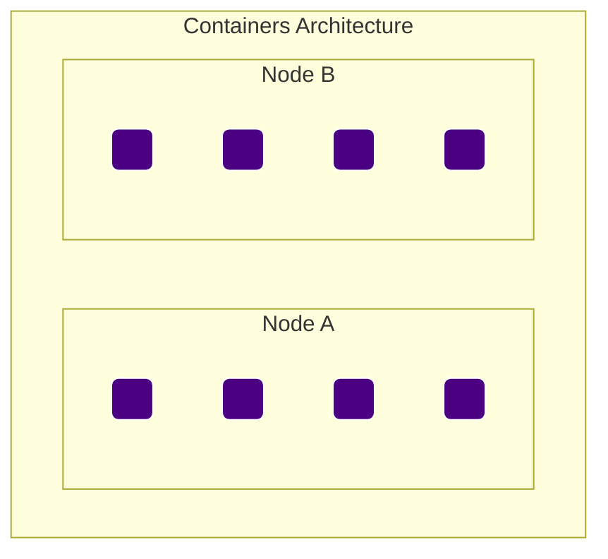

<!-- end_slide -->

# Enfoque con Contenedores

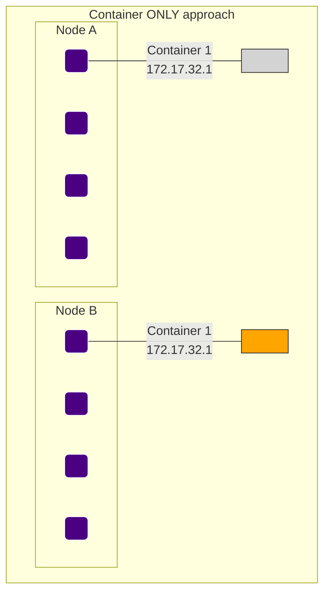

## Limitations

- Los contenedores no se pueden comunicar por defecto
- Los nodos no estan conscientes de las IPs
- Comparten las IPs del mismo host
- Las IPs se pueden romper

<!-- speaker_note: |
Docker:
Containers on Node 1 cannot communicate with containers on Node 2
So it means that in the network it means that are the same item, so it will return localhost, for example.
All the containers on a node share the host IP space and must coordinate which ports they use on that node.
Esto significa que ambos contenedores no pueden tener el mismo port. Tienen que cambiar.
If a containers must be replaced, it will require a new ip address and any hard-coded IP addresses will break.
So... what are the problems that Kubernetes solves?
-->

<!-- end_slide -->

# Enfoque Kubernetes

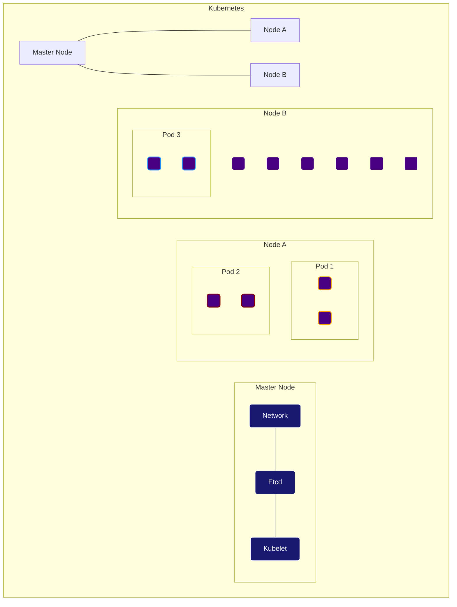

- All containers can communicate with all other containers
- All nodes can communicate with all other containers
- They share the same IP Space

And the reason why that can happen is because...

<!-- end_slide -->

# Arquitectura de Kubernetes

- Master Node o Control Plane
- Worker Node

<!-- end_slide -->

# Control Plane

## Elements of the control plane in Kubernetes.

- Kube-apiserver

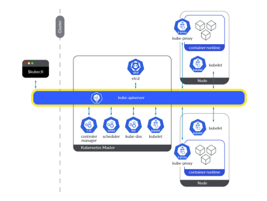

<!-- end_slide -->

# Control Plane

## Elements of the control plane in Kubernetes.

- Kube-apiserver
- Etcd

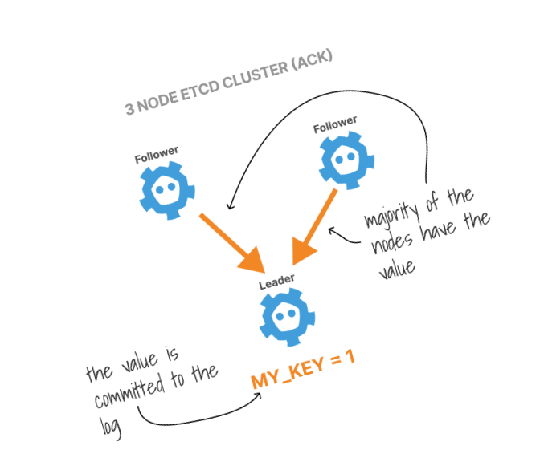

<!-- end_slide -->

# Control Plane

## Elements of the control plane in Kubernetes.

- Kube-apiserver
- Etcd
- Kube-scheduler

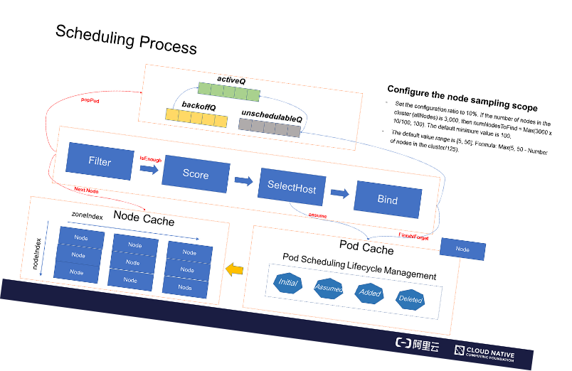

<!-- end_slide -->

# Control Plane

## Elements of the control plane in Kubernetes.

- Kube-apiserver
- Etcd
- Kube-scheduler
- Cloud-controller-manager

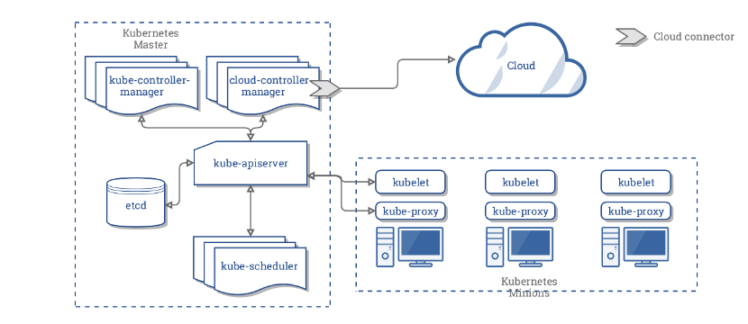

<!-- end_slide -->

# Control Plane

## Elements of the control plane in Kubernetes.

- Kube-apiserver
- Etcd
- Kube-scheduler
- Cloud-controller-manager
- Node components

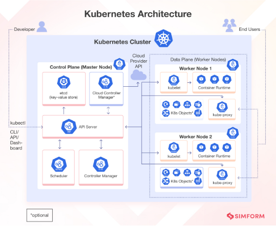

<!-- end_slide -->

# Control Plane

- Es el cerebro del cluster
- Su trabajo es repartir a los contenedores
- Maneja los servicios
- Se encarga de servir los API request

Normalmente, en un ambiente profesional a larga escala,
no tenemos que preocuparnos por estos componentes, ya que
se usa los Managed Kubernetes Clusters o Clústeres de Kubernetes
Gestionados.

<!-- end_slide -->

# Worker Nodes

## Cluster members that can run user workloads

- Kubelet
- Kube-proxy
- Container Runtime

Kubelet is the main Kubernetes agent

- It handles all the communications with the cluster
- If a task won’t run, the kubelet reports the problem to the API server.
- And lets the control plane decide what actions to take.

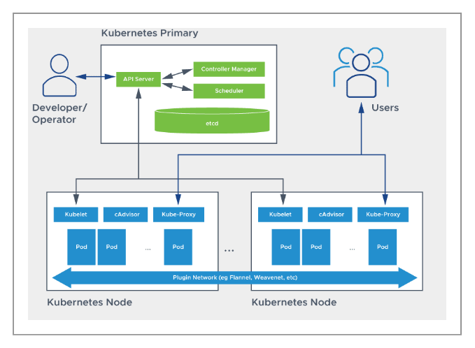

<!-- end_slide -->

# Kubernetes flavors

## Open Source

- Kubernetes
- Minikube
- Rancher
- Openshift Origin
- Talos Linux

## Cloud Managed

- Google Kubernetes Engine
- Azure Kubernetes Service
- Amazon Elastic Kubernetes Service
- IBM Managed Kubernetes Service

## Enterprise

- RedHat Openshift
- Tanzu Kubernetes Grid
- Mirantis
- Elastisys Compliant Kubernetes
- Talos Linux Omni

<!-- end_slide -->

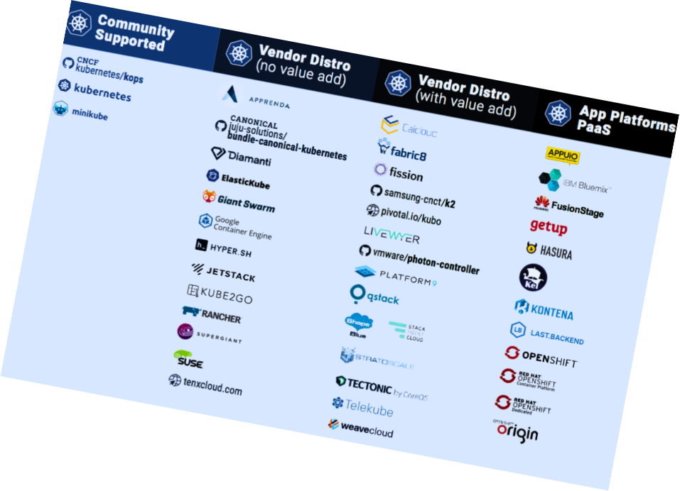
