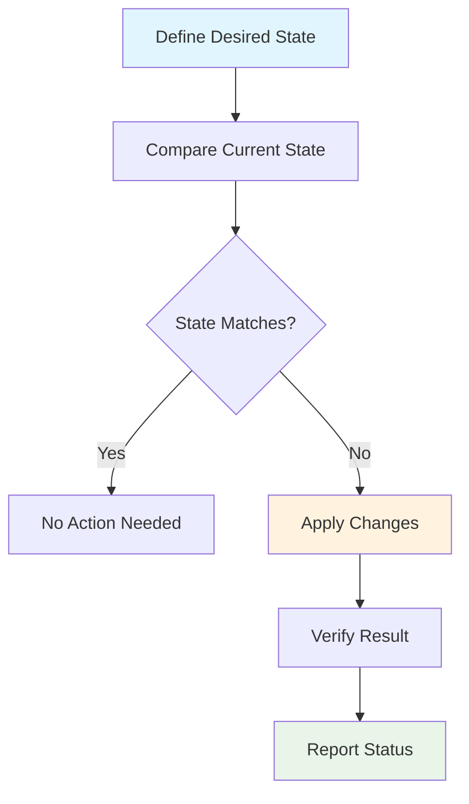
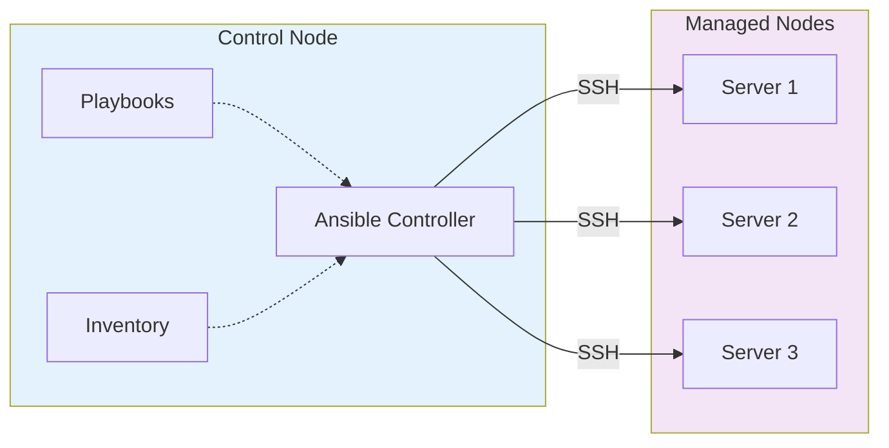
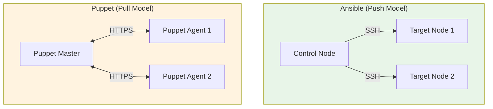

# Configuration Management Workshop

**Modern Infrastructure Automation**

- Focus on Ansible for modern environments
- Practical examples and best practices
- Industry-standard approaches

<!-- speaker_note: Welcome everyone to this configuration management workshop. In the next hour, we'll focus primarily on Ansible, which has become the de facto standard for configuration management in modern infrastructure. We'll cover theoretical concepts but as usual - hands-on examples that you can immediately apply in your work environment or your current or learning guide. -->

<!-- end_slide -->

# Francisco Sanabria

Site Reliability Engineer @ Datasite

- 10+ years of experience in IT
- IBM: Cloud Engineer
- Datasite: Site Reliability Engineer
- Opensource ❤️
- Professional Nerd
  - Homelab
  - Visual Artist

### Contact

- linkedin.com/in/fcosanabria
- github.com/fcosanabria
- instagram.com/digital.death.disrupt

<!-- end_slide -->

# What is Configuration Management?

Configuration Management ensures **consistency** and **reproducibility** across your infrastructure

<!-- pause -->

**Core Concept:**
- Define desired state of systems
- Automatically enforce that state
- Track and manage changes over time

<!-- speaker_note: |

Configuration management is fundamentally about bringing order to chaos in IT infrastructure. Before CM tools, system administrators would manually configure servers, leading to "snowflake servers" - each one slightly different, making troubleshooting and scaling nearly impossible. CM tools allow us to define the desired state of our systems in code, then automatically ensure that state is maintained. -->

<!-- pause -->

**Why it matters in 2025:**
- Cloud-native environments
- Infrastructure as Code (IaC)
- DevOps and GitOps practices
- Compliance and security requirements

<!-- speaker_note: | 

In 2025, configuration management is more critical than ever. With cloud-native environments, we're managing ephemeral infrastructure that can be created and destroyed in minutes. We need to ensure these systems are configured correctly and securely from the moment they're created. This ties into Infrastructure as Code practices where we treat our infrastructure configuration with the same rigor as application code. -->

<!-- end_slide -->

# Configuration Management in a Nutshell



<!-- speaker_note: | 

This flowchart represents the core loop of any configuration management system. We define what we want our systems to look like, compare that with the current state, and if there's a difference, we apply the necessary changes. This is called "convergence" - the system converges toward the desired state. The beauty is that this process is idempotent - running it multiple times produces the same result without side effects. -->


<!-- end_slide -->

# Configuration Management in a Nutshell

**Key Benefits:**
- Consistency across environments
- Reduced manual errors
- Faster deployments
- Better disaster recovery

<!-- end_slide -->

# Dangers of Configuration Management

<!-- pause -->

**🚨 Common Pitfalls:**

- **Configuration drift** - Manual changes outside CM
- **Dependency hell** - Complex interdependencies
- **Failed rollbacks** - Inability to revert changes
- **Security exposure** - Secrets in plain text

<!-- speaker_note: |

Let me share some real-world horror stories. I've seen environments where someone made a "quick fix" directly on servers, bypassing the CM system. When the CM ran next, it reverted the fix, causing an outage. I've also seen cases where circular dependencies in configurations caused entire environments to fail during updates. And unfortunately, I've seen secrets like database passwords stored in plain text in configuration repositories. -->

<!-- pause -->

**⚠️ Best Practices to Avoid Disasters:**
- Always use version control
- Test in staging environments first
- Implement proper secret management
- Monitor configuration drift
- Have rollback procedures ready

<!-- speaker_note: |
The key to avoiding these disasters is discipline and process. Every configuration change should go through version control, be tested in a staging environment that mirrors production, and have a clear rollback plan. Tools like Ansible Vault help with secret management, and monitoring tools can alert you to configuration drift. -->

<!-- end_slide -->

# Elements of Configuration Management

**Core Components Every CM System Has:**

<!-- incremental_lists: true -->

1. **Operations and Parameters** - What actions to take and with what settings
2. **Variables** - Data that changes between environments
3. **Facts** - Information discovered about target systems
4. **Change Handlers** - Actions triggered by configuration changes
5. **Bindings** - How configurations are applied to systems
6. **Bundles** - Groups of related configurations

<!-- speaker_note: |

These elements are universal across all CM systems, though they might have different names. Operations might be called tasks in Ansible, resources in Puppet, or recipes in Chef. Variables allow the same configuration to work in dev, staging, and production with different values. Facts are crucial - the CM system needs to know what OS version, installed packages, and current state before deciding what changes to make. -->

<!-- end_slide -->

# Popular CM Systems Compared

| System | Language | Architecture | Learning Curve | Best For |
|:-------|:---------|:-------------|:---------------|:---------|
| **Ansible** | YAML | Agentless | Easy | Cloud-native, DevOps |
| **Puppet** | Ruby DSL | Agent-based | Steep | Enterprise, compliance |
| **Chef** | Ruby | Agent-based | Steep | Complex environments |
| **Salt** | YAML/Python | Agent-based | Moderate | High-performance |

<!-- speaker_note: |

Each tool has its strengths. Ansible's agentless approach and YAML syntax make it accessible to teams without deep programming skills. Puppet excels in large enterprise environments with complex compliance requirements. Chef is powerful but requires Ruby knowledge. Salt is fast and scalable but has a smaller community. The trend in 2025 is toward Ansible for its simplicity and cloud-native focus. -->

<!-- pause -->

**Market Trends in 2025:**
- Ansible dominates cloud environments
- GitOps integration becoming standard
- Kubernetes-native configuration management emerging

- **[Ansible Documentation](https://docs.ansible.com/)** - Comprehensive official docs
- **[Ansible Galaxy](https://galaxy.ansible.com/)** - Community roles and collections  
- **[Red Hat Learning](https://www.redhat.com/en/services/training/ex407-red-hat-certificate-expertise-ansible-automation)** - Official certification
- **[Ansible Best Practices](https://docs.ansible.com/ansible/latest/user_guide/playbooks_best_practices.html)** - Official best practices guide

<!-- speaker_note: |

These resources will take you from beginner to expert. The official documentation is excellent and includes many examples. Ansible Galaxy is invaluable for finding existing solutions to common problems. If you're serious about Ansible, consider the Red Hat certification - it's well-respected in the industry. -->

<!-- end_slide -->

# Why Ansible Won the CM Wars

<!-- pause -->

**🎯 Key Advantages:**

- **Agentless** - Uses SSH, no agents to manage
- **YAML Syntax** - Human-readable, version control friendly
- **Immediate Results** - Push-based, see changes instantly
- **Low Barrier to Entry** - Easy to start, scales to enterprise
- **Strong Community** - Extensive module ecosystem

<!-- speaker_note: |

Ansible succeeded where others struggled by focusing on simplicity. No agents means no additional infrastructure to manage, no version conflicts, and no security concerns about agent daemons. YAML is readable by both humans and machines, making it perfect for code reviews and collaboration. The push model means you see results immediately, unlike Puppet's pull model where you wait for the next agent run. -->

<!-- pause -->

**Real-world Impact:**
- Faster onboarding for new team members
- Reduced operational overhead
- Better integration with CI/CD pipelines
- Easier troubleshooting and debugging

<!-- end_slide -->

# Introduction to Ansible

**Architecture Overview:**



<!-- speaker_note: |

Ansible's architecture is beautifully simple. You have one control node where Ansible is installed, and it manages multiple target nodes via SSH. No agents, no special ports, no additional services. The control node reads playbooks (which define what you want to do) and inventory files (which define where you want to do it), then executes the tasks over SSH. This simplicity is why Ansible is so popular in cloud environments where servers are ephemeral. -->

<!-- end_slide -->

# Ansible Example - Basic Setup

**Installation:**
```bash
# On Ubuntu/Debian
sudo apt update && sudo apt install ansible

# On RHEL/CentOS
sudo dnf install ansible

# Using pip (recommended for latest version)
pip install ansible
```

<!-- speaker_note: |

Installation is straightforward. While package managers provide stable versions, pip gives you access to the latest features. In production environments, I recommend using pip with virtual environments to avoid conflicts with system packages. -->

<!-- pause -->

**Verify Installation:**
```bash
ansible --version
ansible-playbook --version
```

<!-- pause -->

**Basic Inventory File (`hosts`):**
```ini
[webservers]
web1.example.com
web2.example.com

[databases]
db1.example.com
db2.example.com
```

<!-- speaker_note: |

The inventory file defines your infrastructure. You can group servers by function, environment, or any logical grouping. This simple format scales from a few servers to thousands. You can also use dynamic inventories that pull from cloud providers' APIs. -->

<!-- end_slide -->

# Client Setup and Groups

**SSH Key Setup:**
```bash
# Generate SSH key pair
ssh-keygen -t ed25519 -C "ansible@controlnode"

# Copy public key to managed nodes
ssh-copy-id user@web1.example.com
ssh-copy-id user@web2.example.com
```

<!-- speaker_note: |
SSH key authentication is essential for Ansible automation. Ed25519 keys are modern and secure. In cloud environments, you typically configure SSH keys during instance creation. For existing environments, tools like Ansible itself can help distribute keys once you have initial access. -->

<!-- pause -->

**Advanced Inventory with Variables:**
```ini
[webservers]
web1.example.com ansible_user=ubuntu
web2.example.com ansible_user=centos

[databases]
db1.example.com ansible_user=root ansible_port=2222

[all:vars]
ansible_ssh_private_key_file=~/.ssh/ansible_key
```

<!-- speaker_note: |

This shows how you can specify different SSH users and ports per host. The [all:vars] section applies variables to all hosts. This flexibility allows Ansible to work with heterogeneous environments where different servers have different configurations. -->

<!-- end_slide -->

# Dynamic and Computed Client Groups

**AWS Dynamic Inventory:**
```bash
# Install AWS collection
ansible-galaxy collection install amazon.aws

# Use AWS dynamic inventory
ansible-inventory -i aws_ec2.yml --list
```

**Dynamic Inventory Configuration (`aws_ec2.yml`):**
```yaml
plugin: aws_ec2
regions:
  - us-east-1
  - us-west-2
keyed_groups:
  - key: tags.Environment
    prefix: env
  - key: instance_type
    prefix: type
```

**Benefits:**
- Always up-to-date inventory
- Automatic grouping by cloud tags
- No manual inventory maintenance
- Perfect for auto-scaling environments

<!-- speaker_note: |

Dynamic inventories are game-changers for cloud environments. Instead of manually maintaining inventory files, Ansible queries the cloud provider's API to discover instances. It can automatically group instances by tags, instance types, regions, or any metadata. This means your inventory is always current, even as instances are created and destroyed. -->

<!-- end_slide -->

# Variable Assignments

**Variable Hierarchy (highest to lowest precedence):**

1. **Command line** (`-e` or `--extra-vars`)
2. **Task vars** (in playbook tasks)
3. **Block vars** (in block statements)
4. **Role vars** (in role/vars/main.yml)
5. **Host vars** (host_vars/hostname.yml)
6. **Group vars** (group_vars/groupname.yml)

<!-- speaker_note: |

Understanding variable precedence is crucial for debugging Ansible playbooks. I've seen many hours wasted because someone didn't realize why their variable wasn't taking effect. Command line variables always win, which is useful for overriding values during testing. The hierarchy allows you to set defaults at the group level, override at the host level, and still be able to override everything from the command line. -->

<!-- pause -->

**Example:**
```bash
# Command line override
ansible-playbook -e "nginx_version=1.20" webserver.yml

# In playbook
nginx_version: "1.18"  # This would be overridden
```

<!-- end_slide -->

# Task Lists and State Parameters

**Basic Task Structure:**
```yaml
---
- name: Install and configure nginx
  hosts: webservers
  become: yes
  tasks:
    - name: Install nginx package
      package:
        name: nginx
        state: present
    
    - name: Start and enable nginx service
      service:
        name: nginx
        state: started
        enabled: yes
    
    - name: Copy nginx configuration
      template:
        src: nginx.conf.j2
        dest: /etc/nginx/nginx.conf
        backup: yes
      notify: restart nginx
```

<!-- speaker_note: |

This playbook demonstrates Ansible's declarative approach. We're not saying "run apt install nginx" - we're saying "ensure nginx package is present." Ansible figures out the right command based on the target system. The state parameter is key - "present" means installed, "absent" means removed, "started" means running service. This idempotency is what makes Ansible powerful. -->

<!-- end_slide -->

# State Parameters Deep Dive

**Common State Values:**

| Module | States | Meaning |
|:-------|:-------|:--------|
| **package** | present, absent, latest | Install, remove, or update packages |
| **service** | started, stopped, restarted | Service status control |
| **file** | file, directory, absent, touch | File/directory management |
| **user** | present, absent | User account management |

<!-- speaker_note: |

These states represent the desired end state, not the actions to take. If nginx is already installed and you specify state: present, Ansible does nothing. If it's not installed, Ansible installs it. This idempotency means you can run the same playbook multiple times safely - it will only make changes needed to reach the desired state. -->

<!-- pause -->

**Idempotency Example:**
```yaml
- name: Create application directory
  file:
    path: /opt/myapp
    state: directory
    owner: appuser
    group: appgroup
    mode: '0755'
```

<!-- speaker_note: |

This task will create the directory if it doesn't exist, but if it already exists with the correct permissions, Ansible will do nothing. If it exists but with wrong permissions, Ansible will fix the permissions. This is the power of declarative configuration. -->

<!-- end_slide -->

# Iteration with Loops

**Simple Loop:**
```yaml
- name: Install multiple packages
  package:
    name: "{{ item }}"
    state: present
  loop:
    - nginx
    - postgresql
    - redis-server
    - nodejs
```

<!-- speaker_note: |

Loops eliminate repetitive tasks. Instead of writing separate tasks for each package, we define one task and loop over a list. The loop variable 'item' contains the current value in each iteration. This makes playbooks more maintainable and reduces the chance of copy-paste errors. -->

<!-- pause -->

**Complex Loop with Dictionaries:**
```yaml
- name: Create multiple users
  user:
    name: "{{ item.name }}"
    groups: "{{ item.groups }}"
    state: present
  loop:
    - { name: 'alice', groups: 'sudo,developers' }
    - { name: 'bob', groups: 'developers' }
    - { name: 'charlie', groups: 'sudo,admins' }
```

<!-- speaker_note: |

Complex loops with dictionaries allow you to handle more sophisticated scenarios. Each item in the loop is a dictionary with multiple attributes. This pattern is common when creating users, configuring virtual hosts, or setting up databases. It keeps related configuration together and makes the intent clear. -->

<!-- end_slide -->

# Interaction with Jinja Templates

**Template File (`nginx.conf.j2`):**
```nginx
user {{ nginx_user }};
worker_processes {{ ansible_processor_vcpus }};

upstream backend {

    server {{ server.ip }}:{{ server.port }};

}

server {
    listen {{ nginx_port }};
    server_name {{ domain_name }};
    
    location / {
        proxy_pass http://backend;
    }
}
```

<!-- speaker_note: |

Jinja2 templates are incredibly powerful for generating dynamic configuration files. This nginx configuration uses Ansible facts (like processor count), variables (like nginx_user), and loops to create a customized config for each server. The template can adapt to different environments - dev might have one backend server, production might have ten. -->

<!-- pause -->

**Using the Template:**
```yaml
- name: Deploy nginx configuration
  template:
    src: nginx.conf.j2
    dest: /etc/nginx/nginx.conf
    backup: yes
  notify: reload nginx
```

<!-- end_slide -->

# Template Rendering Example

**Variables File (`group_vars/webservers.yml`):**
```yaml
nginx_user: www-data
nginx_port: 80
domain_name: myapp.example.com
backend_servers:
  - { ip: "10.0.1.10", port: 8080 }
  - { ip: "10.0.1.11", port: 8080 }
  - { ip: "10.0.1.12", port: 8080 }
```

<!-- speaker_note: |

This variables file defines the data that will be substituted into our template. Notice how the backend_servers list will be used in the Jinja loop to create multiple upstream server entries. In different environments, you might have different numbers of backend servers or different IP addresses. -->

<!-- pause -->

**Rendered Output:**
```nginx
user www-data;
worker_processes 4;

upstream backend {
    server 10.0.1.10:8080;
    server 10.0.1.11:8080;
    server 10.0.1.12:8080;
}

server {
    listen 80;
    server_name myapp.example.com;
    
    location / {
        proxy_pass http://backend;
    }
}
```

<!-- speaker_note: |

This is what gets written to the target server. Ansible has automatically inserted the processor count from system facts, and the Jinja loop created three upstream servers. If you add more servers to the backend_servers list, they'll automatically appear in the configuration. This is infrastructure as code in action. -->

<!-- end_slide -->

# Bindings: Plays and Playbooks

**Play Structure:**
```yaml
---
- name: Configure web servers
  hosts: webservers
  become: yes
  vars:
    nginx_version: "1.20"
  tasks:
    - name: Install nginx
      package:
        name: nginx={{ nginx_version }}
        state: present

- name: Configure databases  
  hosts: databases
  become: yes
  tasks:
    - name: Install postgresql
      package:
        name: postgresql
        state: present
```

<!-- speaker_note: |

A playbook contains one or more plays. Each play targets a specific group of hosts and defines what should be done on those hosts. This example has two plays - one for web servers and one for databases. Each play can have its own variables, tasks, and even different privilege escalation settings. This separation allows you to organize complex deployments logically. -->

**Benefits of Multiple Plays:**
- Target different host groups
- Use different privilege levels
- Organize complex deployments
- Enable selective execution

<!-- end_slide -->

# Roles - Organizing Complex Configurations

**Role Directory Structure:**
```
roles/
  nginx/
    tasks/main.yml
    handlers/main.yml
    templates/
      nginx.conf.j2
    vars/main.yml
    defaults/main.yml
    meta/main.yml
```

<!-- speaker_note: |

Roles are Ansible's way of organizing complex configurations into reusable components. Think of a role as a complete package for configuring a specific service. The directory structure is standardized - tasks go in tasks/main.yml, handlers in handlers/main.yml, etc. This organization makes roles portable and shareable across projects and teams. -->

**Using Roles in Playbooks:**
```yaml
---
- name: Setup web infrastructure
  hosts: webservers
  roles:
    - nginx
    - postgresql
    - nodejs
```

<!-- speaker_note: |

Using roles in playbooks is simple and clean. Each role encapsulates all the complexity of configuring that service. Roles can have dependencies - for example, a web application role might depend on nginx and postgresql roles. This dependency management is defined in the meta/main.yml file. -->

<!-- end_slide -->

# Role Example - Nginx Role

**`roles/nginx/tasks/main.yml`:**
```yaml
---
- name: Install nginx
  package:
    name: nginx
    state: present

- name: Copy nginx configuration
  template:
    src: nginx.conf.j2
    dest: /etc/nginx/nginx.conf
    backup: yes
  notify: restart nginx

- name: Start and enable nginx
  service:
    name: nginx
    state: started
    enabled: yes
```

<!-- speaker_note: |

This is a complete nginx role's task file. It handles installation, configuration, and service management. The template task uses the notify directive to trigger a handler when the configuration changes. This is a common pattern - when you change a config file, you need to restart the service to pick up the changes. -->

<!-- pause -->

**`roles/nginx/handlers/main.yml`:**
```yaml
---
- name: restart nginx
  service:
    name: nginx
    state: restarted
```

<!-- speaker_note: |

Handlers are special tasks that only run when triggered by other tasks. The restart nginx handler will only run if the configuration file actually changes. If you run the playbook multiple times and the config doesn't change, the service won't be unnecessarily restarted. This efficient approach reduces service disruptions. -->

<!-- end_slide -->

# Best Practices for Structuring Configuration

**📁 Recommended Directory Structure:**
```
ansible-project/
├── inventories/
│   ├── production/
│   │   ├── hosts
│   │   └── group_vars/
│   └── staging/
│       ├── hosts
│       └── group_vars/
├── roles/
├── playbooks/
├── ansible.cfg
└── requirements.yml
```

<!-- speaker_note: |

This structure separates environments clearly and scales well. Each environment has its own inventory and variables. Roles are shared across environments, but configured differently through environment-specific variables. The requirements.yml file lists external roles and collections your project depends on, making it easy for team members to set up the environment. -->


**🔒 Security Best Practices:**
- Use Ansible Vault for secrets
- Separate sensitive data by environment
- Implement least privilege access
- Regular security audits of playbooks

<!-- speaker_note: |

Security is paramount in configuration management. Ansible Vault encrypts sensitive data like passwords and API keys. Never store secrets in plain text in version control. Use separate vault files for each environment to limit blast radius. Implement role-based access control so developers can access staging but not production secrets. -->

<!-- end_slide -->

# Ansible Vault for Secret Management

**Creating Encrypted Variables:**
```bash
# Create encrypted variable file
ansible-vault create group_vars/production/vault.yml

# Edit encrypted file
ansible-vault edit group_vars/production/vault.yml

# View encrypted file
ansible-vault view group_vars/production/vault.yml
```

<!-- speaker_note: |

Ansible Vault provides built-in encryption for sensitive data. When you create a vault file, you set a password that's required to decrypt it. The file is stored encrypted in your version control system, so secrets are protected even if your repository is compromised. Different environments should have different vault passwords for additional security. -->

<!-- pause -->

**Using Encrypted Variables:**
```yaml
# In vault.yml (encrypted)
vault_db_password: "super_secret_password_123"

# In vars.yml (plain text)
db_password: "{{ vault_db_password }}"
```

<!-- pause -->

**Running with Vault:**
```bash
ansible-playbook --ask-vault-pass site.yml
# or
ansible-playbook --vault-password-file ~/.vault_pass site.yml
```

<!-- speaker_note: |

The naming convention with vault_ prefix makes it clear which variables contain sensitive data. You reference the vault variable from a regular variable, which keeps your playbook readable while securing the actual secrets. In CI/CD environments, you typically store the vault password as an environment variable or secret in your CI system. -->

<!-- end_slide -->

# Hands-On Exercise 1
## Basic Ansible Setup

**Step 1: Install Ansible**
```bash
# Install Ansible
pip3 install ansible

# Verify installation
ansible --version
```

**Step 2: Create Inventory**
```bash
# Create project directory
mkdir ansible-workshop && cd ansible-workshop

# Create inventory file
cat > hosts << EOF
[local]
localhost ansible_connection=local
EOF
```

<!-- speaker_note: |

We're starting with localhost to keep things simple and ensure everyone can follow along. In real environments, you'd list your actual servers here. The ansible_connection=local parameter tells Ansible to run tasks locally instead of over SSH. -->

<!-- end_slide -->

# Hands-On Exercise 1 (continued)

**Step 3: First Playbook**
```yaml
# Create site.yml
cat > site.yml << 'EOF'
---
- name: My first playbook
  hosts: local
  tasks:
    - name: Create a directory
      file:
        path: /tmp/ansible-test
        state: directory
        mode: '0755'
    
    - name: Create a file with content
      copy:
        content: "Hello from Ansible!"
        dest: /tmp/ansible-test/hello.txt
    
    - name: Display file content
      command: cat /tmp/ansible-test/hello.txt
      register: file_content
    
    - name: Show the content
      debug:
        msg: "File contains: {{ file_content.stdout }}"
EOF
```

<!-- speaker_note: |

This playbook demonstrates several key Ansible concepts. We create a directory, write a file, read it back, and display the content. The register keyword captures command output so we can use it in subsequent tasks. The debug module is useful for troubleshooting and displaying information. -->

<!-- end_slide -->

# Hands-On Exercise 1 (continued)

**Step 4: Run the Playbook**
```bash
# Run the playbook
ansible-playbook -i hosts site.yml

# Run again to see idempotency
ansible-playbook -i hosts site.yml
```

<!-- speaker_note: | 

Run the playbook twice to see idempotency in action. The first run will show "changed" status for tasks that create files. The second run will show "ok" status because everything is already in the desired state. This is a key concept - Ansible only makes changes when necessary. -->

**Expected Output:**
- First run: Tasks show "changed" status
- Second run: Tasks show "ok" status (idempotent)

**Step 5: Verify Results**
```bash
# Check created files
ls -la /tmp/ansible-test/
cat /tmp/ansible-test/hello.txt
```

<!-- end_slide -->

# Hands-On Exercise 2
## Web Server Deployment

**Create Nginx Playbook:**
```yaml
cat > webserver.yml << 'EOF'
---
- name: Deploy nginx web server
  hosts: local
  become: yes
  vars:
    nginx_port: 8080
    server_name: workshop.local
  
  tasks:
    - name: Install nginx
      package:
        name: nginx
        state: present
    
    - name: Create nginx configuration from template
      template:
        src: nginx.conf.j2
        dest: /etc/nginx/sites-available/workshop
        backup: yes
      notify: restart nginx
    
    - name: Enable site
      file:
        src: /etc/nginx/sites-available/workshop
        dest: /etc/nginx/sites-enabled/workshop
        state: link
      notify: restart nginx
    
    - name: Start and enable nginx
      service:
        name: nginx
        state: started
        enabled: yes
  
  handlers:
    - name: restart nginx
      service:
        name: nginx
        state: restarted
EOF
```

<!-- speaker_note: |

This playbook demonstrates a real-world scenario - deploying and configuring a web server. We use variables for configuration values, templates for dynamic config files, and handlers to restart services only when configuration changes. The become: yes directive escalates privileges to root, which is needed for package installation and service management. -->

<!-- end_slide -->

# Hands-On Exercise 2 (continued)

**Create Nginx Template:**
```bash
cat > nginx.conf.j2 << 'EOF'
server {
    listen {{ nginx_port }};
    server_name {{ server_name }};
    
    location / {
        root /var/www/html;
        index index.html index.htm;
    }
    
    # Generated by Ansible on {{ ansible_date_time.iso8601 }}
    # Managed node: {{ ansible_hostname }}
    # Processor count: {{ ansible_processor_vcpus }}
}
EOF
```

<!-- speaker_note: |

This template shows how Jinja2 can use both variables we define and Ansible facts about the target system. The ansible_date_time and ansible_hostname are facts automatically gathered by Ansible. This makes each generated configuration unique to its target system while sharing the same template. -->

**Create Web Content:**
```bash
mkdir -p /var/www/html
echo "<h1>Welcome to Ansible Workshop</h1>" | sudo tee /var/www/html/index.html
```

**Run and Test:**
```bash
ansible-playbook -i hosts webserver.yml
curl http://localhost:8080
```

<!-- end_slide -->

# Real-World Ansible Patterns

**Multi-Environment Deployments:**
```yaml
# Production variables (group_vars/production.yml)
nginx_port: 80
app_instances: 3
db_pool_size: 50

# Staging variables (group_vars/staging.yml)  
nginx_port: 8080
app_instances: 1
db_pool_size: 10
```

<!-- speaker_note: |

Real applications need to run differently in different environments. Production might have multiple application instances and larger database connection pools, while staging uses minimal resources. The same playbook works across environments by using different variable files. This pattern scales from two environments to dozens. -->

<!-- pause -->

**Rolling Deployments:**
```yaml
- name: Rolling deployment
  hosts: webservers
  serial: 2  # Deploy to 2 servers at a time
  tasks:
    - name: Remove from load balancer
      uri:
        url: http://lb.example.com/remove/{{ inventory_hostname }}
        method: POST
    
    - name: Deploy application
      # deployment tasks here
      
    - name: Add back to load balancer
      uri:
        url: http://lb.example.com/add/{{ inventory_hostname }}
        method: POST
```

<!-- speaker_note: |

Rolling deployments are crucial for zero-downtime updates. The serial keyword limits how many hosts are updated simultaneously. This example removes servers from the load balancer before updating, then adds them back. This pattern ensures your service remains available during deployments, which is essential for production environments. -->

<!-- end_slide -->

# Ansible vs. Other CM Tools

**Architectural Comparison:**



<!-- speaker_note: |

The fundamental difference is push vs pull. Ansible pushes configurations from a central controller when you run it. Puppet agents pull configurations from the master on a regular schedule. Push model gives immediate feedback and control, but requires the controller to be accessible to all nodes. Pull model works better when nodes are behind firewalls or have intermittent connectivity. -->

**When to Choose Each:**

| Scenario | Best Choice | Reason |
|:---------|:------------|:--------|
| Cloud/DevOps | Ansible | Agentless, immediate feedback |
| Large Enterprise | Puppet/Chef | Mature compliance features |
| High-Performance | Salt | Event-driven architecture |

<!-- speaker_note: |

Choose based on your environment and team skills. Ansible dominates cloud-native environments because it's simple and fits well with CI/CD pipelines. Large enterprises often prefer Puppet or Chef for their mature compliance and reporting features. Salt is fastest for large-scale operations but requires more expertise to implement well. -->

<!-- end_slide -->

# Modern Trends and Best Practices

**GitOps Integration:**
```yaml
# .github/workflows/deploy.yml
name: Deploy Infrastructure
on:
  push:
    branches: [main]
jobs:
  deploy:
    runs-on: ubuntu-latest
    steps:
      - uses: actions/checkout@v2
      - name: Run Ansible Playbook
        run: |
          ansible-playbook -i production/hosts site.yml
```

<!-- speaker_note: |

GitOps means your infrastructure changes are deployed automatically when code is merged to the main branch. This ensures that what's in version control matches what's running in production. CI/CD systems run Ansible playbooks automatically, providing audit trails and consistency. This approach treats infrastructure changes with the same rigor as application code changes. -->

<!-- pause -->

**Container and Kubernetes Integration:**
```yaml
- name: Deploy to Kubernetes
  kubernetes.core.k8s:
    definition:
      apiVersion: apps/v1
      kind: Deployment
      metadata:
        name: "{{ app_name }}"
      spec:
        replicas: "{{ app_replicas }}"
```

<!-- speaker_note: |

Ansible isn't just for traditional servers anymore. The kubernetes.core collection lets you manage Kubernetes resources declaratively. This is useful for initial cluster setup, application deployment, or managing resources that aren't easily handled by Kubernetes-native tools. Many organizations use Ansible to bootstrap Kubernetes clusters and deploy applications. -->

<!-- end_slide -->

# Common Pitfalls and Solutions

**❌ Common Mistakes:**

1. **Storing secrets in plain text**
   - ✅ Use Ansible Vault

2. **No testing in development**
   - ✅ Use staging environments and molecule testing

3. **Overly complex playbooks**
   - ✅ Break into roles and smaller playbooks

4. **Ignoring idempotency**
   - ✅ Test running playbooks multiple times

<!-- speaker_note: |

I've seen these mistakes repeatedly in real environments. The secrets issue is particularly dangerous - I've seen database passwords committed to public repositories. Testing is often skipped due to time pressure, but the cost of production issues far exceeds the time saved. Complex playbooks become unmaintainable. And forgetting about idempotency leads to tasks that fail on subsequent runs. -->

**🔧 Testing Framework Example:**
```bash
# Install molecule for testing
pip install molecule[docker]

# Initialize role testing
molecule init role my-role --driver-name docker

# Run tests
molecule test
```

<!-- speaker_note: |

Molecule is Ansible's testing framework. It can spin up Docker containers or VMs, run your playbooks against them, and verify the results. This catches errors before they reach production. Testing infrastructure code is as important as testing application code, and molecule makes it practical. -->

<!-- end_slide -->

# Workshop Summary

**What We Covered:**

✅ Configuration Management fundamentals  
✅ Ansible architecture and advantages  
✅ Hands-on playbook creation  
✅ Templates and variables  
✅ Roles and best practices  
✅ Security with Ansible Vault  
✅ Real-world deployment patterns  

<!-- speaker_note: |

In just one hour, we've covered the essential concepts and practical skills you need to start using Ansible effectively. You now understand why configuration management is crucial, how Ansible works, and have hands-on experience creating playbooks. Most importantly, you understand the best practices that will help you avoid common pitfalls. -->

<!-- pause -->

**Next Steps:**
- Practice with your own infrastructure
- Explore Ansible Galaxy for community roles
- Implement testing with Molecule
- Integrate with your CI/CD pipeline

<!-- speaker_note: |

The best way to learn Ansible is to use it on real problems. Start small - automate something you currently do manually. Ansible Galaxy has thousands of community-contributed roles that can save you time. As you grow more confident, implement testing and CI/CD integration. Remember, infrastructure as code is a journey, not a destination. -->

<!-- end_slide -->

# Resources and Further Learning

**📚 Essential Resources:**

- **[Ansible Documentation](https://docs.ansible.com/)** - Comprehensive official docs
- **[Ansible Galaxy](https://galaxy.ansible.com/)** - Community roles and collections  
- **[Red Hat Learning](https://www.redhat.com/en/services/training/ex407-red-hat-certificate-expertise-ansible-automation)** - Official certification
- **[Ansible Best Practices](https://docs.ansible.com/ansible/latest/user_guide/playbooks_best_practices.html)** - Official best practices guide

<!-- speaker_note: |

These resources will take you from beginner to expert. The official documentation is excellent and includes many examples. Ansible Galaxy is invaluable for finding existing solutions to common problems. If you're serious about Ansible, consider the Red Hat certification - it's well-respected in the industry. -->

**🛠️ Tools to Explore:**
- **Molecule** - Testing framework
- **AWX/Ansible Tower** - Web UI and enterprise features
- **Semaphore** - Open-source Ansible web UI
- **Ansible Lint** - Playbook linting and best practices

<!-- speaker_note: |

These tools enhance your Ansible experience. Molecule helps you test roles before deploying them. AWX provides a web interface for running playbooks and managing inventories - it's especially useful for teams. Semaphore is a lighter alternative to AWX. Ansible Lint catches common problems in your playbooks automatically. -->

<!-- end_slide -->

# Thank You!

**Questions & Discussion**

Remember: *Infrastructure as Code is not just about tools, it's about culture and practices.*

<!-- speaker_note: |

Thank you all for your attention and participation. Remember that implementing configuration management successfully requires more than just learning the tools - it requires changing how your team thinks about infrastructure. Treat your infrastructure code with the same care as your application code: version control, code reviews, testing, and documentation. This cultural shift is often more challenging than learning the technical aspects, but it's what makes the difference between successful and failed automation initiatives. What questions do you have? -->

<!-- end_slide -->
