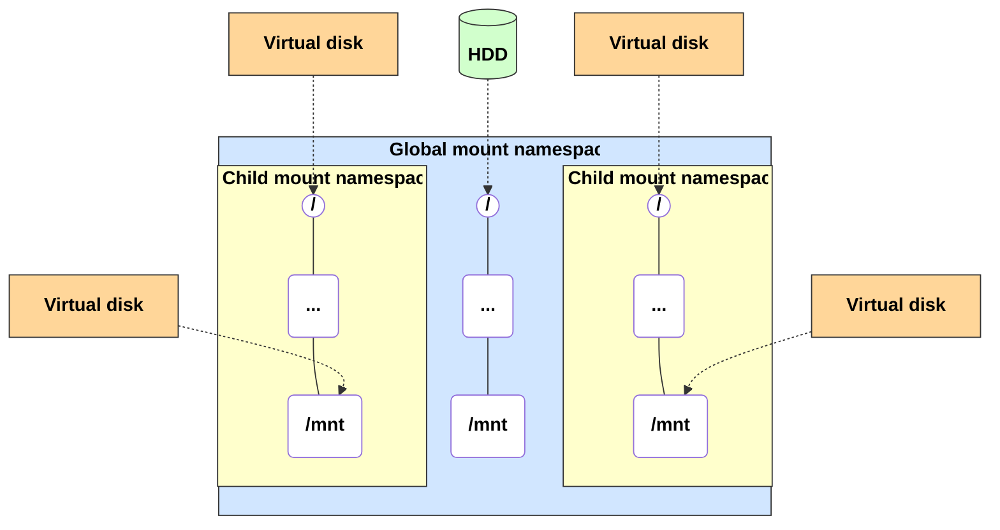
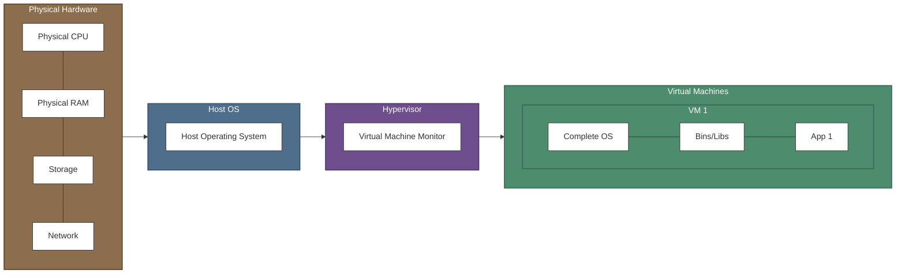
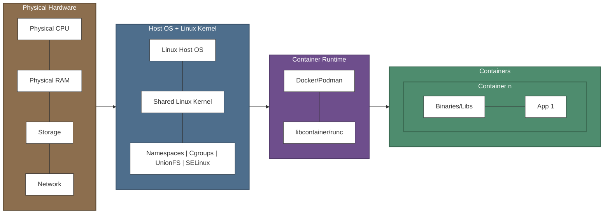
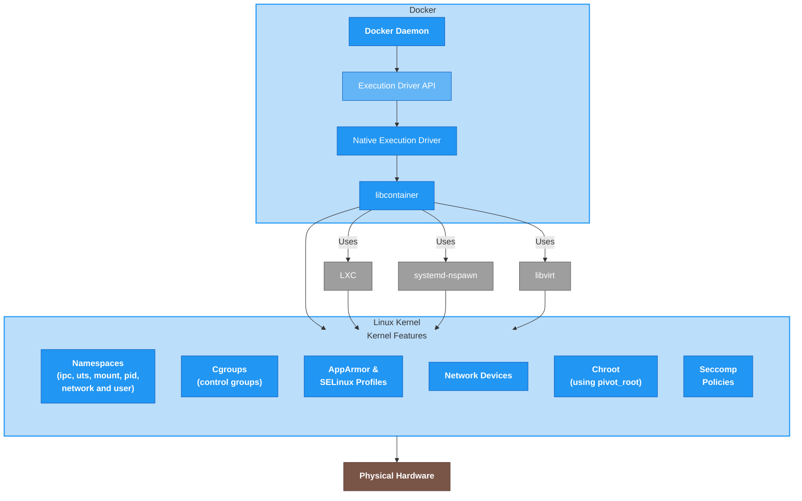

# Linux for Containerization

- Intermediate Level
- Pre-workshop for Kubernetes

<!-- end_slide -->

# Francisco Sanabria

Site Reliability Engineer @ Datasite

- 10+ years of experience in IT
- IBM: Cloud Engineer
- Datasite: Site Reliability Engineer
- Opensource ❤️
- Professional Nerd
  - Homelab
  - Visual Artist

### Contact 

- linkedin.com/in/fcosanabria
- github.com/fcosanabria
- instagram.com/digital.death.disrupt


<!-- end_slide -->

# Tools

- Wezterm Terminal
- Neovim + LazyVim
- Tmux
- Berkeley Mono
- Presenterm
- Mermaid CLI

<!-- end_slide -->

# Linux?

<!-- speaker_note: Here the motivation why linux in your carear and skills.  -->

Containerization?
<!-- pause -->

Kubernetes?
<!-- pause -->

<!-- speaker_note: The reason for giving all this instruction is because what we're going to see in the next workshop is not magic, and it has its reason for being, with Linux implementations as the operating system. 
 -->

<!-- pause -->
It's not magic!

<!-- end_slide -->

# Linux Namespaces

<!-- speaker_note: 
Namespaces are a fundamental feature of the Linux kernel that allows creating abstractions of operating system resources, making a process or group of processes see their own isolated instance of a global resource. 
 -->

- Allows creating abstractions of OS resources.
- Processes see their own instance in an *isolated* way from the whole. 
- It's a logical way of separating resources.

<!-- speaker_note: This technology is the cornerstone that makes containerization possible. -->

- There are many types of namespaces or *name spaces*.

<!-- pause -->
**Let's see some examples**

<!-- end_slide -->

# Types of Linux Namespaces
Linux Name Spaces

<!-- Basically what it does is wrap a global system resource in an abstraction, making processes within that space appear unrelated to the global resource.

So they don't affect the system
 -->

| Namespace | Isolates |
|:---|:---|
| Mount | Mount Points |
| Network | Network devices, stacks, ports, etc. |
| User | User and group identification |
| Control Groups | Control group root directory |
| PID| Process identifiers |


<!-- speaker_note: We could say these are the most important ones, since they are the ones that can be interacted with most frequently when we talk about system and server administration.
 -->

<!-- pause -->
There are several more

<!-- speaker_note: With users and groups, this is now normally automated by third parties when offering cloud services. -->

<!-- end_slide -->

## Example: Mount: mount points


<!-- speaker_note: |
This diagram represents how mount namespaces (Mount Namespaces) work in Linux, which are one of the fundamental features that make container technology possible.

What we're seeing here is a visual representation of how Linux can create multiple views of the file system within the same operating system:

Let's look at the diagram structure:

The outer blue rectangle represents the 'Global Mount Namespace', which is the file system view that the system would have. It contains the basic structure with the directory we know as root (/), various directories (...) and specific mount points like /mnt.

The yellow rectangles are 'Child Mount Namespaces', which represent different or isolated views of the file system. Each one has its own directory hierarchy that can be completely different from the host's.

The dotted lines show how different storage devices are mounted at different points:

The physical disk (HDD, in green) is mounted at the host system root
The virtual disks (in orange) are mounted at different points within the child namespaces -->

<!-- end_slide -->

## HandsOn 1.1
Practical Exercises

PID Namespace

> *Objective*: Shows how the `/bin/bash` process has PID 1 inside the namespace, but a different PID on the host.
```bash
sudo unshare --pid --fork --mount-proc /bin/bash
ps aux  # Will show a very reduced process list with PID 1
```
<!-- end_slide -->

## HandsOn 1.2
Practical Exercises

Network Namespace
> Objective: Create a Virtual Ethernet (veth) pair to connect a network namespace with the host
```bash
# Create a pair of virtual interfaces
sudo ip link add veth0 type veth peer name veth1
# Move veth1 to the namespace
sudo ip link set veth1 netns demo_ns
# Configure IPs
sudo ip addr add 192.168.100.1/24 dev veth0
sudo ip netns exec demo_ns ip addr add 192.168.100.2/24 dev veth1
# Activate interfaces
sudo ip link set veth0 up
sudo ip netns exec demo_ns ip link set veth1 up
sudo ip netns exec demo_ns ip link set lo up
# Test connectivity
sudo ip netns exec demo_ns ping 192.168.100.1
```

<!-- end_slide -->

## HandsOn 1.3
Practical Exercises

Mount Namespace

<!-- speaker_note: Remember Isolates file system mount points, allowing different processes to see different file system hierarchies. -->

> Objective: Allows each container to have its own root file system and mount points.

```bash
mkdir /tmp/mount-demo
sudo unshare --mount /bin/bash
mount -t tmpfs none /tmp/mount-demo
# This mount will only be visible in this namespace
```

<!-- 

Try the following:

# Create a directory for a "mini container"
mkdir -p /tmp/container-root
# Create a file on the host
echo "This is the host" > /tmp/host-file.txt

# Create a new mount namespace
sudo unshare --mount --uts --pid --fork --mount-proc=/proc /bin/bash

# Inside the new namespace, mount a new root
mount --bind /tmp/container-root /tmp/container-root
cd /tmp/container-root
mkdir -p bin etc dev proc
# Mount proc in the new namespace
mount -t proc none proc/
# Create a file inside the container
echo "I'm inside the container" > container-file.txt

# Show that both file systems are different
# but share the same kernel
cat /proc/version
ls -la /
# We can't see /tmp/host-file.txt from here

 -->

<!-- end_slide -->

# Networking for Containerized Environments
Networks 🤝🏻 Containers

Network namespaces are the foundation of network isolation in containers. Each namespace provides a completely independent network stack with its own:

- Network interfaces
- Routing tables
- Firewall rules
- Sockets

<!-- 
Network interfaces
Routing tables
Firewall rules
Sockets 

Explanation: namespaces are like isolated network "bubbles".

At this point we haven't seen what a container is, and you probably already know or don't, but for now, let's stick with the idea that a container is a way to wrap an application or system service.

Note that we're not talking about any Container Engine, like Docker, Podman or Linux Containers. Remember that for now we're only talking about Namespaces as system containers.

We'll see Container Engines soon. But later. 

-->


<!-- end_slide -->

# Creating and Examining Namespaces

First we create two namespaces:

```bash
# Create two namespaces
sudo ip netns add ns1
sudo ip netns add ns2
```

<!-- pause -->
Then we examine the namespaces:

```bash
# Examining namespaces
sudo ip netns exec ns1 ip link show
sudo ip netns exec ns2 ip link show
```

<!-- pause -->
Output from namespace ns1:

```bash
sudo ip netns exec ns1 ip link show
1: lo: <LOOPBACK> mtu 65536 qdisc noop state DOWN mode DEFAULT group default qlen 1000
    link/loopback 00:00:00:00:00:00 brd 00:00:00:00:00:00
2: tunl0@NONE: <NOARP> mtu 1480 qdisc noop state DOWN mode DEFAULT group default qlen 1000
    link/ipip 0.0.0.0 brd 0.0.0.0
3: sit0@NONE: <NOARP> mtu 1480 qdisc noop state DOWN mode DEFAULT group default qlen 1000
    link/sit 0.0.0.0 brd 0.0.0.0
4: ip6tnl0@NONE: <NOARP> mtu 1452 qdisc noop state DOWN mode DEFAULT group default qlen 1000
    link/tunnel6 :: brd :: permaddr 86c3:80e5:c593::
```

<!-- pause -->
Output from namespace ns2:

```bash
sudo ip netns exec ns2 ip link show
1: lo: <LOOPBACK> mtu 65536 qdisc noop state DOWN mode DEFAULT group default qlen 1000
    link/loopback 00:00:00:00:00:00 brd 00:00:00:00:00:00
2: tunl0@NONE: <NOARP> mtu 1480 qdisc noop state DOWN mode DEFAULT group default qlen 1000
    link/ipip 0.0.0.0 brd 0.0.0.0
3: sit0@NONE: <NOARP> mtu 1480 qdisc noop state DOWN mode DEFAULT group default qlen 1000
    link/sit 0.0.0.0 brd 0.0.0.0
4: ip6tnl0@NONE: <NOARP> mtu 1452 qdisc noop state DOWN mode DEFAULT group default qlen 1000
    link/tunnel6 :: brd :: permaddr 9aaf:2eb4:1e3e::
```

<!-- end_slide -->

# Comparing Network Namespaces

<!-- pause -->
### Differences Between Namespaces

These namespaces are identical except for one key difference:

**NS1**
```bash
link/tunnel6 :: brd :: permaddr 86c3:80e5:c593::
```

**NS2**
```bash
link/tunnel6 :: brd :: permaddr 9aaf:2eb4:1e3e::
```

<!-- pause -->
### What does this mean?

Each namespace has a unique identifier for its IPv6 tunnel interface

<!-- end_slide -->

# Detailed Explanation

<!-- pause -->
### Why are they different?

Each namespace is an isolated network environment with:

- Its own network interfaces
- Its own routing tables
- Its own firewall rules

<!-- pause -->

The unique identifier (**permaddr**) ensures that each namespace can be uniquely identified on the network, even when using virtual interfaces with the same configuration.

<!-- pause -->

- Network namespaces allow isolating complete network environments

- Each namespace has its own independent network devices

- They are the foundation of technologies like containers and lightweight virtualization

<!-- end_slide -->

## Common Use Cases

<!-- pause -->

- Containers (Docker, LXC)
- Network Function Virtualization (NFV)
- Service isolation
- Multi-tenant environments

We'll eventually see the networking models for containers. 

<!-- speaker_note: BUTTTTT -->

<!-- pause -->
🚨 Spoiler alert 🚨 it's a bridge; bridge networking model

<!-- 
... Which is the default.

Although yes, there are others like Host and Overlay, where the container shares the host's network namespace and where communication between containers on different hosts is allowed.-->


<!-- end_slide -->

# DNS and Service Discovery
Name resolution in containerized environments

Name resolution is **crucial** for communication between services in container environments.

<!-- speaker_note: There are several mechanisms for name resolution in container environments. -->
<!-- pause -->
DNS systems in container environments

- **Internal DNS in Docker**
- **CoreDNS in Kubernetes** 
- **Hosts file-based resolution**

<!-- end_slide -->

# Internal DNS Operation in Containers

<!-- speaker_note: An orchestrator is a system to effectively and massively control containers -->

General DNS resolution process in containers

1. **Container registration in DNS**
2. **Resolution configuration in the container**
3. **Recursive lookup (if necessary)**

<!-- pause -->

1. **Container registration in DNS**
   - At startup, the orchestrator registers the container with its name
   - The internal IP is associated with the container name

2. **Resolution configuration in the container**
3. **Recursive lookup (if necessary)**

<!-- pause -->

1. **Container registration in DNS**
   - At startup, the orchestrator registers the container with its name
   - The internal IP is associated with the container name

2. **Resolution configuration in the container**
   - /etc/resolv.conf is configured internally
   - The orchestrator's DNS is configured as the primary nameserver

3. **Recursive lookup (if necessary)**

<!-- pause -->

1. **Container registration in DNS**
   - At startup, the orchestrator registers the container with its name
   - The internal IP is associated with the container name

2. **Resolution configuration in the container**
   - /etc/resolv.conf is configured internally
   - The orchestrator's DNS is configured as the primary nameserver

3. **Recursive lookup (if necessary)**
   - If not found in local DNS, queries external DNS
   - Follows the configured resolution chain

> We'll see this later with real examples. Refer to: # LATER: Docker DNS Resolution Demonstration

<!-- speaker_note: And yes, I know we missed security and storage, but if we covered that, we'd never finish. -->

<!-- end_slide -->

# Linux Container Fundamentals

  - **History and evolution**: from chroot to modern containers
  <!-- speaker_note: | chroot (1979) was the beginning, isolating the root filesystem. In fact, this command helps us a lot when changing the root password on a server, since after isolating and re-indexing the system metadata, the system returns to normal.  
  
  Then came Jails (FreeBSD, 2000), Solaris Zones (2004), OpenVZ (2005), LXC (2008) and finally Docker (2013) popularized the concept. -->
  
  - **Fundamental architecture**: Namespaces and Cgroups
  <!-- speaker_note: Namespaces (PID, NET, MNT, etc.) isolate the view of resources. Cgroups (Control Groups) limit and monitor resource usage (CPU, memory, I/O). -->
  
  - **Differences** between containers and virtual machines (VMs)
  <!-- speaker_note: Containers share the host kernel, are lighter and faster. VMs virtualize hardware and run a complete OS, let's see... this provides greater isolation but generates more computational overhead. -->
  
  - **Use cases** and limitations
  <!-- speaker_note: | 
  
  Ideal for microservices, Continuous Integration and Continuous Delivery CI/CD, development and more. 
  
  Limitations are that we cannot run different OSes than the host. And the same applies to architectures. No virtualization. They can be emulated, yes, but it's different from virtualization. 
  
  And why can't it? remember that the kernel is shared. In security isolation (shared kernel)-->


<!-- end_slide -->

<!-- speaker_note: let's talk about namespaces - No lie, we already saw it. I'm kidding, we're not going to see it again.
 -->

# Fundamental Architecture
Namespaces

<!-- pause -->


<!-- end_slide -->

# Differences between containers and virtual machines
Virtual Machines

<!-- speaker_note: |

In the first diagram we can observe the layered structure of virtual machines:

- Physical base: The underlying hardware that provides physical resources (CPU, RAM, storage and network).
- Host operating system: The layer that manages access to physical hardware.
- Hypervisor: The virtualization technology that creates and manages virtual machines. The hypervisor emulates virtual hardware for each VM.
Independent virtual machines: Each one with:

- A complete operating system (with its own kernel)
- Its own libraries and binaries
- The applications running inside -->

The most notable feature is that each virtual machine functions as an independent OS, with its own operating system. This implies greater overhead but also greater isolation.

<!-- speaker_note: It's like a duplication of resources. -->


<!-- end_slide -->

# Differences between containers and virtual machines
Containers

<!-- speaker_note: | 

The second diagram shows the radically different approach of containers:

- Physical base: The same underlying hardware.
- Host operating system with Linux kernel: Unlike VMs, there is a single operating system and a single kernel shared among all containers. This makes them much lighter but also less isolated than VMs. It's important to note that isolated doesn't overlap with security, but security does overlap with isolation. 

Linux kernel characteristics: 
- Containers work thanks to these native technologies:

- Namespaces: Provide isolation of processes, networks, file systems, etc.
- Control Groups (cgroups): Limit and isolate resource usage
- Union File Systems: Enable the layer system for images
- Security mechanisms: Like capabilities, SELinux, AppArmor and others

Containers don't include complete operating systems, only the binaries and libraries necessary for applications. 

 -->



---



<!-- end_slide -->

# Registries and Image Acquisition

A practical guide for working with image repositories.

<!-- speaker_note: https://docs.docker.com/engine/install/ -->

<!-- speaker_note: | 

Ok, from now on, since we know what container architecture looks like, now we can start working with them. 

Congratulations, now you know that the concept of containers is no longer magic. You know where they come from, their origin and how they work from the operating system side. We're just missing one more concept now. Which is important to continue.-->

<!-- It turns out that from somewhere, we have to get the containers, somehow they have to be built, there has to be something before the container, for that to exist, right? Well, here comes that concept I was saying was missing; images. 

Images are basically what allows us to build containers. They are the real and unique reference for container construction. These images include the application code, necessary libraries, and dependencies, binaries and more. 

Something very similar to ISO images when we install an operating system, just without the operating system and all those other things.
-->


<!-- end_slide -->

# Docker Hub

<!-- pause -->
It's the most widely used public registry, with thousands of official and community images.

<!-- pause -->
```bash
# Verify that you can access Docker Hub
docker search nginx
```

<!-- pause -->
### What does Docker Hub offer?

- Official images verified by Docker
- Thousands of community images
- Free and paid repositories
- Integration with CI/CD tools

<!-- end_slide -->

# Quay.io

<!-- pause -->
An alternative registry maintained by Red Hat, popular in enterprise environments.

<!-- pause -->
```bash
# Example download from Quay.io
docker pull quay.io/prometheus/prometheus
```

<!-- pause -->
### Quay.io Features

- Support for vulnerability analysis
- Advanced security policies
- Visible build history
- Popular in Red Hat and OpenShift environments


<!-- end_slide -->

# Private Registries

<!-- pause -->
Useful for proprietary images or corporate environments that require access control.

<!-- pause -->

```bash
# Authentication to a private registry
docker login my-private-registry.example.com

# Pull from a private registry
docker pull my-private-registry.example.com/my-app:1.0
```

> This depends a lot on the company's needs.

<!--  speaker_note: |

By default, in our company, we use credentials configured in our development environment using JFrog, Harbor and VPN. 

Harbor is a Self-Hosting solution, which allows having it in our own infrastructure, so we don't need to use docker login for image pulls, but since it's already inside our internal networks with VPN and environment variables set in our .zshrc or .bashrc we can communicate with Harbor. -->

<!-- pause -->

Benefits of private registries

- Complete control over images
- Proprietary code confidentiality
- Fast download speeds on internal networks
- Compliance with enterprise policies

<!-- end_slide -->


# **pull** Command: Obtaining Images and Tags

<!-- pause -->
The `pull` command downloads container images from registries.

<!-- pause -->
```bash
# Formato básico: docker pull [registro/]imagen[:etiqueta]
```

<!-- pause -->
### Ejemplos de uso

```bash
# Pull de la última versión (tag "latest")
docker pull nginx

# Pull de una versión específica
docker pull nginx:1.21.6-alpine

# Pull desde un registro específico con namespace
docker pull gcr.io/kubernetes-e2e-test-images/dnsutils:1.1
```

<!-- end_slide -->

# Anatomía de un Nombre de Imagen

<!-- pause -->

**Registro** (opcional, por defecto Docker Hub)
- `quay.io/prometheus/prometheus`

**Namespace/Imagen** (requerido)  
- `quay.io/prometheus/prometheus`

**Tag** (opcional, por defecto latest)
- `nginx:1.21.6-alpine`

<!-- pause -->

Cuando no se especifica un registro, Docker Hub se usa por defecto:

```bash
docker pull nginx

# Equivalente a:
docker pull docker.io/library/nginx:latest
```

<!-- end_slide -->

# Consejos Prácticos para Trabajar con Registros

<!-- pause -->
### Buenas prácticas

- Evitar usar la etiqueta `latest` en producción
- Usar etiquetas específicas para garantizar reproducibilidad

<!-- pause -->
### Verification and security

```bash
# Verify image information before using it
docker inspect nginx:1.21.6-alpine

# View image layers
docker history nginx:1.21.6-alpine
```

<!-- speaker_note: This is useful, because lately there have been cases of malicious code. But they have been very isolated and unique, very specific cases. So we shouldn't worry too much, but extra precaution never hurts. Additionally, in a good CI/CD environment with a good engineering and operations team, this verification is implemented statically in the implemented registry. But well, that's another topic. -->

<!-- end_slide -->

# Container Inspection

Docker provides tools to examine containers

```bash
# Running containers
docker ps

# All containers (including stopped ones)
docker ps -a

# View only IDs
docker ps -q

# View images
docker images ls

# Details in JSON format
docker inspect my-container
```

<!-- end_slide -->

# Logs and Basic Monitoring

```bash

# View all logs
docker logs my-container

# Follow logs in real time (like tail -f)
docker logs -f my-container

# View the last N logs
docker logs --tail=10 my-container

docker logs -t my-container

# Basic monitoring of CPU, memory, network and I/O
docker stats my-container

```

<!-- speaker_note: Input/Output -->

<!-- end_slide -->

# Docker DNS Resolution Demonstration

<!-- pause -->
Creating a network with custom DNS

```bash
# Create a network with custom DNS
docker network create --driver bridge network_with_dns
```

> This command creates an isolated network with its own internal DNS service.

<!-- end_slide -->

# Docker Demonstration (continued)

Create the first container:
```bash
# Create containers with names
docker run -d --network network_with_dns --name service1 nginx
```

<!-- pause -->
Create the second container:
```bash
# Create containers with names
docker run -d --network network_with_dns --name service1 nginx
docker run -d --network network_with_dns --name service2 nginx
```

<!-- pause -->
Test DNS resolution:
```bash
# Create containers with names
docker run -d --network network_with_dns --name service1 nginx
docker run -d --network network_with_dns --name service2 nginx

# Demonstrate resolution by name
docker run --rm --network network_with_dns alpine ping -c 2 service1
```

<!-- pause -->

What's happening?

1. Two services are created on the same network called "service1" and "service2"
2. Docker's internal DNS automatically registers the names
3. A third ephemeral container can access them by name, without knowing their IPs

<!-- end_slide -->

# DNS Resolution Result

<!-- pause -->

```bash
PING service1 (172.18.0.2): 56 data bytes
64 bytes from 172.18.0.2: seq=0 ttl=64 time=0.069 ms
64 bytes from 172.18.0.2: seq=1 ttl=64 time=0.084 ms

--- service1 ping statistics ---
2 packets transmitted, 2 packets received, 0% packet loss
round-trip min/avg/max = 0.069/0.076/0.084 ms
```

The name **service1** is automatically resolved to IP address **172.18.0.2** without additional configuration.

<!-- end_slide -->

# Resolution Between Different Networks

<!-- pause -->

Docker DNS Limitations

By default, containers on different networks **cannot resolve** names between each other.

### Strategies for cross-network communication

- Use an external DNS service
- Implement a service discovery solution (Consul, etcd)

<!-- end_slide -->

# HandsOn 2.1
Registry and image retrieval

1. Search for database images on Docker Hub
2. Download specific versions
4. Create a Docker Hub account and authenticate
5. Tag and upload an image to your account

<!-- 

1. Search for database images on Docker Hub:

docker search postgres
docker search mysql

2. Download specific versions:

docker pull postgres:13-alpine
docker pull mysql: 8.0

3. Explore image metadata:

docker image inspect postgres:13-alpine

4. Create a Docker Hub account and authenticate:

docker login

5. Tag and upload an image to your account:

docker pull hello-world
docker tag hello-world your-username/my-hello-world:v1
docker push your-username/my-hello-world:v1

 -->

<!-- end_slide -->

# HandsOn 2.2

1. Create a network for containers to communicate:

```bash
docker network create lamp-network
```
2. Start a MySQL container with volume for persistent data:

```bash
mkdir -p ~/lamp-data/mysql

docker run -d \
--name db \
--network lamp-network \
-e MYSQL_ROOT_PASSWORD=secret \
-e MYSQL_DATABASE=app \
-e MYSQL_USER=app_user \
-e MYSQL_PASSWORD=app_pass \
-v ~/lamp-data/mysql:/var/lib/mysql \
mysql:8.0
```

<!-- end_slide -->

3. Start a PHP-Apache server with your code:

```bash
mkdir -p ~/lamp-data/html
echo "<?php phpinfo(); ?>" > ~/lamp-data/html/index.php

docker run -d \
--name web \
--network lamp-network \
-p 8080:80 \
-v ~/lamp-data/html:/var/www/html \
php:8.0-apache
```

4. Verify that containers communicate:

```bash
docker exec -it web bash
# Inside the container:
apt-get update && apt-get install -y default-mysql-client
mysql -u app_user -papp_pass -h db app
```

5. Monitor the containers:

```bash
docker stats db web
```

<!-- end_slide -->

# Thank you!


<!-- end_slide -->
