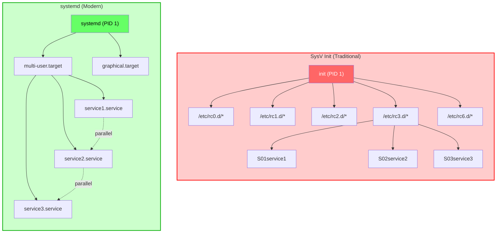

# Systemd Fundamentals Workshop

**2 Sessions - 4 Hours Total**

- Session 1: Fundamentals and Basic Management
- Session 2: Advanced Configuration and Automation

<!-- end_slide -->

# Francisco Sanabria

Site Reliability Engineer @ Datasite

- 10+ years of experience in IT
- IBM: Cloud Engineer
- Datasite: Site Reliability Engineer
- Opensource ❤️
- Professional Nerd
  - Homelab
  - Visual Artist

### Contact

- linkedin.com/in/fcosanabria
- github.com/fcosanabria
- instagram.com/digital.death.disrupt

<!-- end_slide -->

## Deliverables

<!-- incremental_lists: true-->

- Systemd command cheat sheet
- Unit file templates
- Example scripts
- Common troubleshooting cases

<!-- end_slide -->

# **SESSION 1**

## Fundamentals and Basic Management

<!-- end_slide -->

# What is systemd?

<!-- speaker_note: systemd is a system and service manager for Linux operating systems -->

**systemd** is a comprehensive system and service manager for Linux

<!-- pause -->

**Key Features:**
- Process supervision and management
- On-demand starting of daemons
- Snapshot support
- Process tracking using Linux cgroups
- Maintains mount points
- A lot more :)

<!-- speaker_note: systemd does far more than init. It’s a system abstraction layer, one which unifies all the little differences in the kernel, userspace and hardware and presents a reasonably sane interface to it all.  -->

<!-- pause -->

**Why did it "replace" SysV init?**

<!-- pause -->

What is an init system? 

 

<!-- end_slide -->

# What is an Init System?

**Init System** = The first process that starts when your computer boots

<!-- pause -->

**Key Responsibilities:**
- **PID 1** - Always has Process ID 1
- **Parent of all processes** - Starts and manages other processes
- **System initialization** - Mounts filesystems, starts services
- **Process supervision** - Monitors and restarts failed services
- **System shutdown** - Cleanly stops services and unmounts filesystems

<!-- pause -->

**Evolution of Init Systems:**
- **1970s**: Original Unix init
- **1980s**: System V init (SysV)
- ...
- **2006**: Upstart (Ubuntu)
- **2010**: systemd (Red Hat, now standard)

<!-- speaker_note: | 

The init system is the first program to be run after the kernel and is what starts up everything else.

The init system is critical - if PID 1 dies, the kernel panics and the system crashes. This is why init systems must be extremely reliable 

So, for example it is the responsable of starting the docker.server and socket for you when you initialize the system. Or as I we saw in the last workshop about Mounts... It is the responsable of mounting those file systems. 

And this is commonly called as Bootstrapping the system. 

It is worth learning the basics of how to do simple stuff with each popular system.
-->

> Here is a great blog post about the Linux Init systems: https://crnx.net/an-introduction-to-linux-init-systems-and-their-evolution-through-time/

<!-- end_slide -->

> Ok, let's go back

<!-- end_slide -->

# What is systemd?

**systemd** is a comprehensive system and service manager for Linux

**Key Features:**
- Process supervision and management
- On-demand starting of daemons
- Snapshot support
- Process tracking using Linux cgroups
- Maintains mount points
- A lot more :)

**Why did it replace SysV init?**
<!-- pause -->
- Faster boot times
- Better dependency handling
- More robust service management
- Unified logging system
- Modern feature set

<!-- end_slide -->

# SysV init vs systemd

<!-- speaker_note: The key difference is that SysV init starts services sequentially, while systemd can start them in parallel based on dependencies -->
