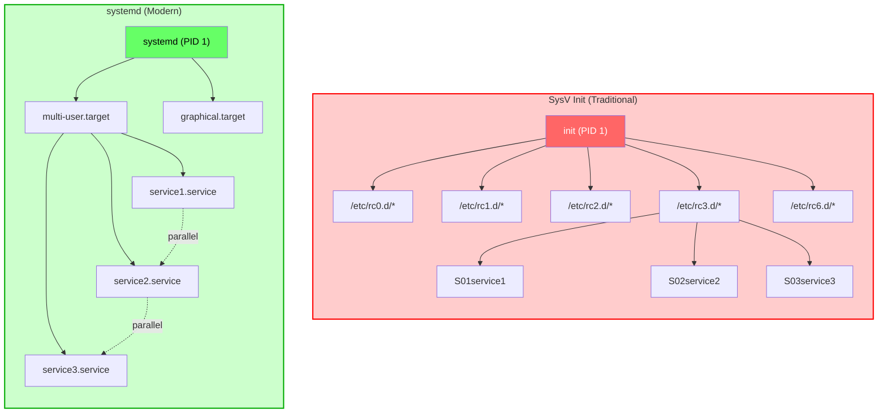
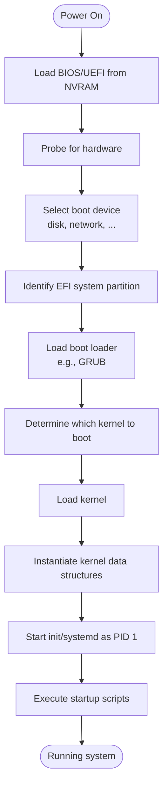
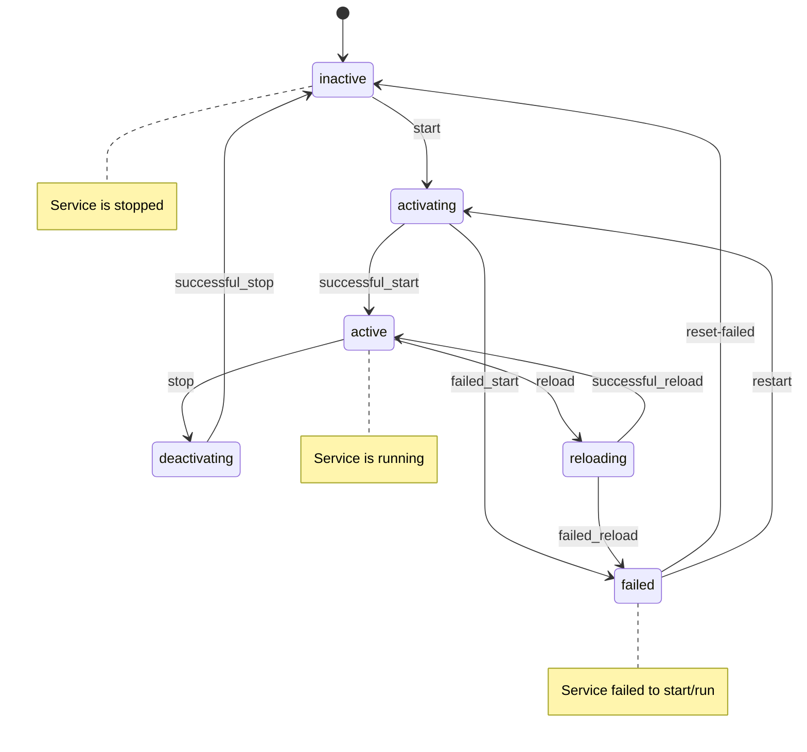

# Systemd Fundamentals Workshop

**2 Sessions - 4 Hours Total**

- Session 1: Fundamentals and Basic Management
- Session 2: Advanced Configuration and Automation

<!-- end_slide -->

# Francisco Sanabria

Site Reliability Engineer @ Datasite

- 10+ years of experience in IT
- IBM: Cloud Engineer
- Datasite: Site Reliability Engineer
- Opensource ❤️
- Professional Nerd
  - Homelab
  - Visual Artist

### Contact

- linkedin.com/in/fcosanabria
- github.com/fcosanabria
- instagram.com/digital.death.disrupt

<!-- end_slide -->

## Deliverables

<!-- incremental_lists: true-->

- Systemd command cheat sheet
- Unit file templates
- Example scripts
- Common troubleshooting cases

<!-- end_slide -->

# **SESSION 1**

## Fundamentals and Basic Management


<!-- end_slide -->

# What is systemd?

<!-- speaker_note: systemd is a system and service manager for Linux operating systems -->

**systemd** is a comprehensive system and service manager for Linux

<!-- pause -->

**Key Features:**
- Process supervision and management
- On-demand starting of daemons
- Snapshot support
- Process tracking using Linux cgroups
- Maintains mount points
- A lot more :)

<!-- speaker_note: systemd does far more than init. It’s a system abstraction layer, one which unifies all the little differences in the kernel, userspace and hardware and presents a reasonably sane interface to it all.  -->

<!-- pause -->

**Why did it "replace" SysV init?**

<!-- pause -->

What is an init system? 

 

<!-- end_slide -->

# What is an Init System?

**Init System** = The first process that starts when your computer boots

<!-- pause -->

**Key Responsibilities:**
- **PID 1** - Always has Process ID 1
- **Parent of all processes** - Starts and manages other processes
- **System initialization** - Mounts filesystems, starts services
- **Process supervision** - Monitors and restarts failed services
- **System shutdown** - Cleanly stops services and unmounts filesystems

<!-- pause -->

**Evolution of Init Systems:**
- **1970s**: Original Unix init
- **1980s**: System V init (SysV)
- ...
- **2006**: Upstart (Ubuntu)
- **2010**: systemd (Red Hat, now standard)

<!-- speaker_note: | 

The init system is the first program to be run after the kernel and is what starts up everything else.

The init system is critical - if PID 1 dies, the kernel panics and the system crashes. This is why init systems must be extremely reliable 

So, for example it is the responsable of starting the docker.server and socket for you when you initialize the system. Or as I we saw in the last workshop about Mounts... It is the responsable of mounting those file systems. 

And this is commonly called as Bootstrapping the system. 

It is worth learning the basics of how to do simple stuff with each popular system.
-->

> Here is a great blog post about the Linux Init systems: https://crnx.net/an-introduction-to-linux-init-systems-and-their-evolution-through-time/

<!-- end_slide -->

> Ok, let's go back

<!-- end_slide -->

# What is systemd?

**systemd** is a comprehensive system and service manager for Linux


**Key Features:**
- Process supervision and management
- On-demand starting of daemons
- Snapshot support
- Process tracking using Linux cgroups
- Maintains mount points
- A lot more :)


**Why did it replace SysV init?**
<!-- pause -->
- Faster boot times
- Better dependency handling
- More robust service management
- Unified logging system
- Modern feature set

<!-- end_slide -->

# SysV init vs systemd



<!-- speaker_note: The key difference is that SysV init starts services sequentially, while systemd can start them in parallel based on dependencies -->

<!-- end_slide -->

# systemd Architecture

**Core Components:**

<!-- incremental_lists: true -->

1. **Units** - Basic objects that systemd manages
   - Services, sockets, devices, mount points, etc.

2. **Targets** - Groups of units (similar to runlevels)
   - multi-user.target, graphical.target, etc.

3. **Dependencies** - Relationships between units
   - Requires, Wants, After, Before

<!-- speaker_note: |
Units can be said to be similar to services or jobs in other init systems. However, a unit has a much broader definition, as these can be used to abstract services, network resources, devices, filesystem mounts, and isolated resource pools.

Systemd categories units according to the type of resource they describe. The easiest way to determine the type of a unit is with its type suffix, which is appended to the end of the resource name.

For now, we are going to focus on Units.
-->

<!-- end_slide -->


# Unit Types

| Unit Type | Extension | Purpose |
|:----------|:----------|:--------|
| Service | `.service` | System services and applications |
| Socket | `.socket` | IPC sockets, network sockets |
| Target | `.target` | Group of units (like runlevels) |
| Mount | `.mount` | File system mount points |
| Device | `.device` | Hardware devices |
| Path | `.path` | File/directory monitoring |

<!-- speaker_note: |
These are the most common unit types you'll work with. Services are the most important for day-to-day administration

. service: A service unit describes how to manage a service or application on the server. This will include how to start or stop the service, under which circumstances it should be automatically started, and the dependency and ordering information for related software.

.socket: A socket unit file describes a network or IPC socket, or a FIFO buffer that systemd uses for socket-based activation. These always have an associated .service file that will be started when activity is seen on the socket that this unit defines.

.target: A target unit is used to provide synchronization points for other units when booting up or changing states. They also can be used to bring the system to a new state. Other units specify their relation to targets to become tied to the target’s operations.

.mount: This unit defines a mountpoint on the system to be managed by systemd. These are named after the mount path, with slashes changed to dashes. Entries within /etc/fstab can have units created automatically.


.device: A unit that describes a device that has been designated as needing systemd management by udev or the sysfs filesystem. Not all devices will have .device files.

.path: This unit defines a path that can be used for path-based activation. Basically it can monitor paths for changes.
-->

<!-- end_slide -->



<!-- end_slide -->

# Basic Commands - systemctl

**Service Management:**

```bash
# Start a service
systemctl start nginx

# Stop a service  
systemctl stop nginx

# Restart a service
systemctl restart nginx

# Reload configuration without restart
systemctl reload nginx

# Enable service at boot
systemctl enable nginx

# Disable service at boot
systemctl disable nginx
```

<!-- end_slide -->

# Basic Commands - systemctl (continued)

**Status and Information:**

```bash
# Check service status
systemctl status nginx

# Check if service is active
systemctl is-active nginx

# Check if service is enabled
systemctl is-enabled nginx

# List all services
systemctl list-units --type=service

# List failed services
systemctl --failed
```

<!-- end_slide -->
# Service States and Transitions



<!-- speaker_note: Understanding these states is crucial for troubleshooting services -->

<!-- end_slide -->

# Logging with journalctl

**systemd** uses **journald** for centralized logging

```bash
# View all logs
journalctl

# Follow logs in real-time
journalctl -f

# View logs for specific service
journalctl -u nginx

# View logs since boot
journalctl -b

# View logs for last hour
journalctl --since "1 hour ago"

# View logs between dates
journalctl --since "2025-01-01" --until "2025-01-02"
```

<!-- end_slide -->

# journalctl Options (continued)

```bash
# Show only error and above
journalctl -p err

# Show logs in reverse order (newest first)
journalctl -r

# Show only kernel messages
journalctl -k

# Show logs with specific priority
journalctl -p warning

# Limit output lines
journalctl -n 50

# Show logs in JSON format
journalctl -o json
```


<!-- speaker_note: The journalctl command is extremely powerful and replaces many traditional log viewing tools -->

<!-- end_slide -->

# Hands-On Exercise 1.1
## Managing Existing Services

**Practice Basic Service Management**

```bash
# Check status of SSH service
systemctl status ssh

# If SSH is not running, start it
sudo systemctl start ssh

# Enable SSH to start at boot
sudo systemctl enable ssh

# Check if it's enabled
systemctl is-enabled ssh

# View SSH logs
journalctl -u ssh -n 20
```

<!-- pause -->

**Try with other services:** `nginx`, `apache2`, `postgresql`

<!-- end_slide -->

# Creating a Simple Custom Service

**Step 1: Create a simple script**

```bash
# Create a directory for our service
sudo mkdir -p /opt/myapp

# Create a simple script
sudo tee /opt/myapp/hello.sh << 'EOF'
#!/bin/bash
while true; do
    echo "Hello from my service: $(date)"
    sleep 10
done
EOF

# Make it executable
sudo chmod +x /opt/myapp/hello.sh
```

<!-- end_slide -->

# Creating a Simple Custom Service (continued)

**Step 2: Create the service unit file**

```bash
sudo tee /etc/systemd/system/hello.service << 'EOF'
[Unit]
Description=Hello World Service
After=network.target

[Service]
Type=simple
User=nobody
ExecStart=/opt/myapp/hello.sh
Restart=always
RestartSec=3

[Install]
WantedBy=multi-user.target
EOF
```

<!-- end_slide -->

# Service Unit File Breakdown

```bash
[Unit]
Description=Hello World Service    # Human-readable description
After=network.target              # Start after network is ready

[Service]
Type=simple                       # Service type
User=nobody                       # Run as specific user
ExecStart=/opt/myapp/hello.sh    # Command to execute
Restart=always                    # Restart policy
RestartSec=3                     # Wait 3 seconds before restart

[Install]
WantedBy=multi-user.target       # Target that wants this service
```

<!-- speaker_note: The [Unit] section defines metadata and dependencies, [Service] defines how to run the service, and [Install] defines installation information -->

<!-- end_slide -->

# Testing Our Custom Service

```bash
# Reload systemd to read new unit file
sudo systemctl daemon-reload

# Start our service
sudo systemctl start hello.service

# Check status
systemctl status hello.service

# View logs
journalctl -u hello.service -f

# Enable at boot
sudo systemctl enable hello.service

# Stop the service
sudo systemctl stop hello.service
```

<!-- end_slide -->

# Hands-On Exercise 1.2
## Create a Python Service

**Create a Python web server service**

```bash
# Create Python script
sudo tee /opt/myapp/webserver.py << 'EOF'
#!/usr/bin/env python3
import http.server
import socketserver
import os

PORT = 8080
os.chdir('/var/www/html')

Handler = http.server.SimpleHTTPRequestHandler
with socketserver.TCPServer(("", PORT), Handler) as httpd:
    print(f"Server running on port {PORT}")
    httpd.serve_forever()
EOF

sudo chmod +x /opt/myapp/webserver.py
```

<!-- end_slide -->

# Python Service Unit File

```bash
sudo tee /etc/systemd/system/python-web.service << 'EOF'
[Unit]
Description=Simple Python Web Server
After=network.target

[Service]
Type=simple
User=www-data
Group=www-data
ExecStart=/usr/bin/python3 /opt/myapp/webserver.py
Restart=always
RestartSec=5

[Install]
WantedBy=multi-user.target
EOF
```

**Test the service:**
```bash
sudo systemctl daemon-reload
sudo systemctl start python-web.service
curl http://localhost:8080
```

<!-- end_slide -->

# Troubleshooting Failed Services

**Common issues and solutions:**

```bash
# Check service status
systemctl status failed-service.service

# View detailed logs
journalctl -u failed-service.service -n 50

# Check configuration syntax
systemd-analyze verify /etc/systemd/system/myservice.service

# Reset failed state
sudo systemctl reset-failed failed-service.service

# Check dependencies
systemctl list-dependencies myservice.service
```

<!-- end_slide -->

# Troubleshooting Exercise

**Let's create a deliberately broken service:**

```bash
sudo tee /etc/systemd/system/broken.service << 'EOF'
[Unit]
Description=Broken Service Example
After=network.target

[Service]
Type=simple
ExecStart=/nonexistent/command
Restart=no

[Install]
WantedBy=multi-user.target
EOF

sudo systemctl daemon-reload
sudo systemctl start broken.service
```

**Now troubleshoot it using the commands we learned!**

<!-- end_slide -->

# Session 1 Summary

**What we covered:**

- systemd architecture and concepts
- Basic service management with `systemctl`
- Log analysis with `journalctl`
- Creating custom services
- Basic troubleshooting techniques

<!-- pause -->

**Key takeaways:**
- systemd provides powerful service management
- Unit files define service behavior
- journalctl centralizes logging
- Always reload daemon after editing unit files

<!-- end_slide -->
<!-- end_slide -->
# Resources

https://docs.redhat.com/en/documentation/red_hat_enterprise_linux/10/html/using_systemd_unit_files_to_customize_and_optimize_your_system/working-with-systemd-unit-files
https://wiki.archlinux.org/title/Systemd
https://www.man7.org/linux/man-pages/man5/systemd.unit.5.html
https://www.digitalocean.com/community/tutorials/understanding-systemd-units-and-unit-files

<!-- end_slide -->
