```mermaid
flowchart LR
    subgraph Hardware["Hardware Físico"]
        direction TB
        CPU["CPU Física"] --- RAM["RAM Física"] --- Storage["Almacenamiento"] --- Network["Red"]
    end
    
    subgraph Host["SO Host + Kernel Linux"]
        direction TB
        HostOS["SO Host Linux"] --- Kernel["Kernel Linux Compartido"]
        Kernel --- Features["Namespaces | Cgroups | UnionFS | SELinux"]
    end
    
    subgraph Runtime["Container Runtime"]
        direction TB
        Docker["Docker/Podman"] --- LibC["libcontainer/runc"]
    end
    
    subgraph Containers["Contenedores"]
        direction TB
        subgraph C1["Contenedor n"]
            Bins1["Binarios/Libs"] --- App1["App 1"]
        end
    end
    
    Hardware --> Host --> Runtime --> Containers
    
    %% Estilos
    classDef hardware fill:#8C6E4E,color:white,stroke:#5D4A33,stroke-width:2px
    classDef host fill:#4E6E8C,color:white,stroke:#3B536B,stroke-width:2px
    classDef runtime fill:#6E4E8C,color:white,stroke:#523B6B,stroke-width:2px
    classDef container fill:#4E8C6E,color:white,stroke:#3B6B53,stroke-width:2px
    classDef component fill:#FFFFFF,stroke:#333333,stroke-width:1px
    
    class Hardware hardware
    class Host host
    class Runtime runtime
    class Containers,C1,C2,C3 container
    class CPU,RAM,Storage,Network,HostOS,Kernel,Features,Docker,LibC,Bins1,Bins2,Bins3,App1,App2,App3 component
```

---
fonts:
  mono: 'Fira Code'
  sans: 'Fira Sans'
author: Francisco Sanabria @ Datasite
# You can also start simply with 'default'
theme: default
# random image from a curated Unsplash collection by Anthony
# like them? see https://unsplash.com/collections/94734566/slidev
# background: https://cover.sli.dev
# some information about your slides (markdown enabled)
title: Linux para contenerización y Kubernetes
info: |
  Linux para contenerización y Kubernetes
# apply unocss classes to the current slide
class: text-center
# https://sli.dev/features/drawing
drawings:
  persist: false
# slide transition: https://sli.dev/guide/animations.html#slide-transitions
transition: fade-out
# enable MDC Syntax: https://sli.dev/features/mdc
mdc: true
# open graph
# seoMeta:
#  ogImage: https://cover.sli.dev
---
# Linux para contenerización

Nivel Intermedio - Avanzado 

Pre-taller para Kubernetes

<div class="abs-br m-6 text-xl">
  <button @click="$slidev.nav.openInEditor()" title="Open in Editor" class="slidev-icon-btn">
    <carbon:edit />
  </button>
  <a href="https://github.com/fcosanabria" target="_blank" class="slidev-icon-btn">
    <carbon:logo-github />
  </a>
</div>

<div class="absolute left-30px bottom-30px">
  Datasite
</div>

<!--
The last comment block of each slide will be treated as slide notes. It will be visible and editable in Presenter Mode along with the slide. [Read more in the docs](https://sli.dev/guide/syntax.html#notes)
-->

---
layout: image-right
image: https://dropsharebluewhale.blob.core.windows.net/dropshare/2025-04-18-12.22.52.png
---

# Francisco Sanabria

Site Reliability Engineer @ Datasite

- <div v-click>Professional Nerd | Homelab | Visual Artist</div>

- <div v-click>Certified Kubernetes Administrator</div>

- <div v-click>10 years of experience in IT</div>

<!--
You can have `style` tag in markdown to override the style for the current page.
Learn more: https://sli.dev/features/slide-scope-style
-->

<style>
h1 {
  background-color: #2B90B6;
  background-image: linear-gradient(45deg,rgb(148, 82, 142) 10%, #146b8c 50%);
  background-size: 100%;
  -webkit-background-clip: text;
  -moz-background-clip: text;
  -webkit-text-fill-color: transparent;
  -moz-text-fill-color: transparent;
}
</style>

<!--
Here is another comment.
-->
---
layout: two-cols
layoutClass: gap-16
---

# Agenda

Esta será la agenda para el día de hoy: 

::right::

<Toc text-sm minDepth="1" maxDepth="2" />

---

# Herrramientas

- Fira Sans
- Fira Code
- Sli.dev
  - Markdown based slides

---

# ¿Linux?
  ---

<div v-click>

¿Contenerización?

¿Kubernetes?

</div>

<!-- 
El motivo de dar toda esta instruducción es por que lo que vamos a ver en el próximo taller no es magia, y tiene su razón de ser, con implementaciones de Linux como sistema operativo. 
 -->

<div v-click>¡No es magia!</div>

---

# Linux Namespaces
Espacios de nombre en Linux

<!-- 
Los namespaces son una característica fundamental del kernel de Linux que permite crear abstracciones de recursos del sistema operativo, haciendo que un proceso o grupo de procesos vean su propia instancia aislada de un recurso global. 
 -->

- Permite crear abstracciones de recursos en el SO.
- Los procesos ven su propia instanacia de una forma *aislada* a un todo. 
- Es una manera lógica de separación de recursos.

<!-- Esta tecnología es la piedra angular que hace posible la contenerización. -->

- Existen muchos tipos de namespaces o *espacios de nombre*.

<div v-click>

**Veamos algunos ejemplos**

</div>

---

# Tipos de Linux Namespaces
Espacios de nombre en Linux

<!-- Basicamente lo que hace es envolver un recurso global del sistema en una abstracción, haciendo parecer a los procesos dentro de ese espacio sean ajenos al recurso global.

Por lo que no afectan al sistema
 -->

| Espacio de nombres | Aislados |
|:---|:---|
| <span v-mark.circle.red="2">Mount</span> | <span v-mark.underline.orange="2">Puntos de Montaje</span> |
| <span v-mark.circle.red="2">Network</span> | <span v-mark.underline.orange="2">Dispositivos de red, stacks, puertos, etc.</span>  |
| User | Identificación de usuarios y grupos |
| Control Groups | Directorio raíz del grupo de control |
| PID| Identificadores de procesos |


<!-- Estos podriamos decir que son los más importantes, puesto que son los que se pueden interacturar de manera más frequente; cuando hablamos de administración de sistemas y servidores.
 -->

<div v-click="1">

Hay varios más

</div>

<!-- Con los usuarios y grupos, ahora esto normalmente se encuentra automatizado por terceros al momento de ofrecer el servicio en la nube. -->

---

## Ejemplo: Mount: puntos de montaje


<!-- 
Este diagrama representa el funcionamiento de los namespaces de montaje (Mount Namespaces) en Linux, que son una de las características fundamentales que hacen posible la tecnología de contenedores.

Lo que estamos viendo aquí es una representación visual de cómo Linux puede crear múltiples vistas del sistema de archivos dentro del mismo sistema operativo:

Veamos la Estructura del diagrama:

El rectángulo azul exterior representa el 'Namespace Global de Montaje', que es la vista del sistema de archivos que tendría el sistema. Contiene la estructura básica con el directorio, que conocemos como root (/), directorios varios (...) y puntos especificos de montaje como /mnt.

Los rectángulos amarillos son 'Namespaces Hijos, basicamente, del Montaje', que representan vistas distintas o aisladas del sistema de archivos, del filesystem. Ahora, cada uno tiene su propia jerarquía de directorios que puede ser completamente diferente de la del host.

Las líneas punteadas muestran cómo diferentes dispositivos de almacenamiento se montan en distintos puntos:

El disco físico (HDD, en verde) está montado en la raíz del sistema host
Los discos virtuales (en naranja) están montados en diferentes puntos dentro de los namespaces hijo -->

---

## HandsOn 1.1
Ejercicios Prácticos

PID Namespace

> *Objectivo*: Muestra cómo el proceso `/bin/bash` tiene PID 1 dentro del namespace, pero un PID diferente en el host.
```bash
sudo unshare --pid --fork --mount-proc /bin/bash
ps aux  # Mostrará una lista de procesos muy reducida con PID 1
```
---

## HandsOn 1.2
Ejercicios Prácticos

Network Namespace
> Objetivo: Crear un par Virtual Ethernet (veth) para conectar un namespace de red con el host
```bash
# Crear un par de interfaces virtuales
sudo ip link add veth0 type veth peer name veth1
# Mover veth1 al namespace
sudo ip link set veth1 netns demo_ns
# Configurar IPs
sudo ip addr add 192.168.100.1/24 dev veth0
sudo ip netns exec demo_ns ip addr add 192.168.100.2/24 dev veth1
# Activar interfaces
sudo ip link set veth0 up
sudo ip netns exec demo_ns ip link set veth1 up
sudo ip netns exec demo_ns ip link set lo up
# Probar conectividad
sudo ip netns exec demo_ns ping 192.168.100.1
```

---

## HandsOn 1.3
Ejercicios Prácticos

Mount Namespace

<!-- Recordemos: Aísla puntos de montaje del sistema de archivos, permitiendo que diferentes procesos vean diferentes jerarquías de sistemas de archivos. -->

> Objetivo: Permite que cada contenedor tenga su propio sistema de archivos root y puntos de montaje.

```bash
mkdir /tmp/mount-demo
sudo unshare --mount /bin/bash
mount -t tmpfs none /tmp/mount-demo
# Este montaje solo será visible en este namespace
```

<!-- 

Intentar lo siguiente:

# Crear un directorio para un "mini contenedor"
mkdir -p /tmp/container-root
# Crear un archivo en el host
echo "Esto es el host" > /tmp/host-file.txt

# Crear un nuevo namespace de montaje
sudo unshare --mount --uts --pid --fork --mount-proc=/proc /bin/bash

# Dentro del nuevo namespace, montar un nuevo root
mount --bind /tmp/container-root /tmp/container-root
cd /tmp/container-root
mkdir -p bin etc dev proc
# Montar proc en el nuevo namespace
mount -t proc none proc/
# Crear un archivo dentro del contenedor
echo "Estoy dentro del contenedor" > container-file.txt

# Mostrar que ambos sistemas de archivos son diferentes
# pero comparten el mismo kernel
cat /proc/version
ls -la /
# No podemos ver /tmp/host-file.txt desde aquí

 -->

---

# Networking para entornos containerizados
Redes 🤝🏻 Contenedores

Los network namespaces son la base del aislamiento de red en contenedores. Cada namespace proporciona una pila (stack) de red completamente independiente con sus propias:

- Network interfaces
- Routing tables
- Firewall rules
- Sockets

<!-- 
Interfaces de red
Tablas de enrutamiento
Reglas de firewall
Sockets 

Explicación: los namespaces son como "burbujas" de red aisladas.

A este punto no hemos visto que es un contenedor, y probablemente ya lo sepan o no, pero por el momento, quedemonos con la idea de que un contenedor es una manera de embolver una applicación o un servicio del sistema.

Ojo que no estamos hablando de ningun Container Engine, como lo es Docker, o Podman o Linux Containers. Recordemos que por el momento solo estamos hablando de Namespaces como contenedores del sistema. 

Pronto vamos a ver a Container Engines. Pero despues. 

-->


---
highlighter: shiki
lineNumbers: true
---

# Creación y Examinación de Namespaces

````md magic-move {lines: true}
```bash
# Crear dos namespaces
sudo ip netns add ns1
sudo ip netns add ns2
```

```bash
# Crear dos namespaces
sudo ip netns add ns1
sudo ip netns add ns2

# Examinando namespaces
sudo ip netns exec ns1 ip link show
sudo ip netns exec ns2 ip link show
```

```bash
# Examinando namespaces
sudo ip netns exec ns1 ip link show
1: lo: <LOOPBACK> mtu 65536 qdisc noop state DOWN mode DEFAULT group default qlen 1000
    link/loopback 00:00:00:00:00:00 brd 00:00:00:00:00:00
2: tunl0@NONE: <NOARP> mtu 1480 qdisc noop state DOWN mode DEFAULT group default qlen 1000
    link/ipip 0.0.0.0 brd 0.0.0.0
3: sit0@NONE: <NOARP> mtu 1480 qdisc noop state DOWN mode DEFAULT group default qlen 1000
    link/sit 0.0.0.0 brd 0.0.0.0
4: ip6tnl0@NONE: <NOARP> mtu 1452 qdisc noop state DOWN mode DEFAULT group default qlen 1000
    link/tunnel6 :: brd :: permaddr 86c3:80e5:c593::
```

```bash
# Examinando namespaces
sudo ip netns exec ns1 ip link show
1: lo: <LOOPBACK> mtu 65536 qdisc noop state DOWN mode DEFAULT group default qlen 1000
    link/loopback 00:00:00:00:00:00 brd 00:00:00:00:00:00
2: tunl0@NONE: <NOARP> mtu 1480 qdisc noop state DOWN mode DEFAULT group default qlen 1000
    link/ipip 0.0.0.0 brd 0.0.0.0
3: sit0@NONE: <NOARP> mtu 1480 qdisc noop state DOWN mode DEFAULT group default qlen 1000
    link/sit 0.0.0.0 brd 0.0.0.0
4: ip6tnl0@NONE: <NOARP> mtu 1452 qdisc noop state DOWN mode DEFAULT group default qlen 1000
    link/tunnel6 :: brd :: permaddr 86c3:80e5:c593::

sudo ip netns exec ns2 ip link show
```

```bash
# Examinando namespaces
sudo ip netns exec ns1 ip link show
1: lo: <LOOPBACK> mtu 65536 qdisc noop state DOWN mode DEFAULT group default qlen 1000
    link/loopback 00:00:00:00:00:00 brd 00:00:00:00:00:00
2: tunl0@NONE: <NOARP> mtu 1480 qdisc noop state DOWN mode DEFAULT group default qlen 1000
    link/ipip 0.0.0.0 brd 0.0.0.0
3: sit0@NONE: <NOARP> mtu 1480 qdisc noop state DOWN mode DEFAULT group default qlen 1000
    link/sit 0.0.0.0 brd 0.0.0.0
4: ip6tnl0@NONE: <NOARP> mtu 1452 qdisc noop state DOWN mode DEFAULT group default qlen 1000
    link/tunnel6 :: brd :: permaddr 86c3:80e5:c593::

sudo ip netns exec ns2 ip link show
1: lo: <LOOPBACK> mtu 65536 qdisc noop state DOWN mode DEFAULT group default qlen 1000
    link/loopback 00:00:00:00:00:00 brd 00:00:00:00:00:00
2: tunl0@NONE: <NOARP> mtu 1480 qdisc noop state DOWN mode DEFAULT group default qlen 1000
    link/ipip 0.0.0.0 brd 0.0.0.0
3: sit0@NONE: <NOARP> mtu 1480 qdisc noop state DOWN mode DEFAULT group default qlen 1000
    link/sit 0.0.0.0 brd 0.0.0.0
4: ip6tnl0@NONE: <NOARP> mtu 1452 qdisc noop state DOWN mode DEFAULT group default qlen 1000
    link/tunnel6 :: brd :: permaddr 9aaf:2eb4:1e3e::
```
````

---

# Comparando Network Namespaces

<div v-click>
<h3>Diferencias Entre Namespaces</h3>

Estos namespaces son idénticos excepto por una diferencia clave:

<div class="grid grid-cols-2 gap-4">
<div>
<h4>NS1</h4>

```bash
link/tunnel6 :: brd :: permaddr 86c3:80e5:c593::
```
</div>
<div>
<h4>NS2</h4>

```bash
link/tunnel6 :: brd :: permaddr 9aaf:2eb4:1e3e::
```
</div>
</div>
</div>

<div v-click>
<h3>¿Qué significa esto?</h3>

Cada namespace tiene un identificador único para su interfaz de túnel IPv6
</div>

---

# Explicación Detallada

<div v-click>
<h3>¿Por qué son diferentes?</h3>

Cada namespace es un entorno de red aislado con:

- Sus propias interfaces de red
- Sus propias tablas de enrutamiento
- Sus propias reglas de firewall
</div>

<div v-click>

El identificador único (<span v-mark.circle.red>permaddr</span>) asegura que cada namespace pueda ser identificado de manera única en la red, incluso cuando usan interfaces virtuales con la misma configuración.

</div>

<div v-click>

- Los namespaces de red permiten aislar entornos de red completos

- Cada namespace tiene sus propios dispositivos de red independientes

- Son la base de tecnologías como contenedores y virtualización ligera

</div>

---

## Casos de uso comunes

<div v-click>

- Contenedores (Docker, LXC)
- Virtualización de redes (NFV)
- Aislamiento de servicios
- Entornos multi-tenant

Eventualmente veremos los modelos de redes para los contenedores. 

</div>

<!-- PEROOOOOOOO -->

<div v-click>
🚨 Spoiler alert 🚨 es un puente; bridge networking model
</div>

<!-- 
... Que es por defecto.

Aunque sí, hay otras como Host, y Overlay, donde el contenedor comparte el ns de red del host y donde se permite la comunicacion entre contenededore en diferentes hosts.-->


---

# DNS y Service Discovery
Resolución de nombres en entornos containerizados

La resolución de nombres es <span v-mark.underline.orange>crucial</span> para la comunicación entre servicios en entornos de contenedores.

<!-- Existen varios mecanismos para resolucion de nombres en entornos de contenedores. -->
<div v-click>
Sistemas DNS en entornos de contenedores
  <div class="grid grid-cols-3 gap-4">
    <div class="p-4 border rounded">
      <h4>DNS interno en Docker</h4>
      <!-- <p>Sistema incorporado que permite resolución por nombre de contenedor en la misma red</p> -->
    </div>
    <div class="p-4 border rounded">
      <h4>CoreDNS en Kubernetes</h4>
      <!-- <p>Solución flexible y extensible para clústers de Kubernetes</p> -->
    </div>
    <div class="p-4 border rounded">
      <h4>Resolución basada en archivos hosts</h4>
      <!-- <p>Método tradicional que aún se utiliza como respaldo</p> -->
    </div>
  </div>
</div>

---

# Funcionamiento Interno de DNS en Contenedores

<!-- Un orquestador es un sistema para poder controlar de manera eficaz y masiva contenedores -->

Proceso general de resolución DNS en contenedores

````md magic-move {lines: true}
```
1. Registro de contenedor en DNS
2. Configuración de resolución en el contenedor
3. Búsqueda recursiva (si es necesario)
```

```
1. Registro de contenedor en DNS
   - Al iniciar, el orquestador registra el contenedor con su nombre
   - Se asocia la IP interna con el nombre del contenedor

2. Configuración de resolución en el contenedor
3. Búsqueda recursiva (si es necesario)
```

```
1. Registro de contenedor en DNS
   - Al iniciar, el orquestador registra el contenedor con su nombre
   - Se asocia la IP interna con el nombre del contenedor

2. Configuración de resolución en el contenedor
   - Se configura /etc/resolv.conf internamente
   - El DNS del orquestador se configura como nameserver principal

3. Búsqueda recursiva (si es necesario)
```

```
1. Registro de contenedor en DNS
   - Al iniciar, el orquestador registra el contenedor con su nombre
   - Se asocia la IP interna con el nombre del contenedor

2. Configuración de resolución en el contenedor
   - Se configura /etc/resolv.conf internamente
   - El DNS del orquestador se configura como nameserver principal

3. Búsqueda recursiva (si es necesario)
   - Si no se encuentra en el DNS local, consulta DNS externos
   - Sigue la cadena de resolución configurada
```
````

> Más adelante veremos esto, con ejemplos reales. Referirme a: # DESPUES: Demostración de resolución DNS en Docker

<!-- Y sí, sé que nos faltaron ver seguridad, y almacenamiento, pero si lo vemos, nunca terminariamos. -->

---

# Fundamentos de los Contenedores Linux

  - <span v-mark.underline.orange>Historia y evolución</span>: de chroot a contenedores modernos
  <!-- chroot (1979) fue el inicio, aislando el root filesystem. Que de hecho, este comando nos facilita un montón el cambio de la contraseña de root en un servidor, ya que este despues de aislar y re-indexar la metadata del sistema, el sistema vuelve a la normalidad.  
  
  Luego vinieron Jails (FreeBSD, 2000), Solaris Zones (2004), OpenVZ (2005), LXC (2008) y finalmente Docker (2013) popularizó el concepto. -->
  
  - <span v-mark.underline.orange>Arquitectura fundamental</span>: Namespaces y Cgroups
  <!-- Los Namespaces (PID, NET, MNT, etc.) aíslan la vista de los recursos. Los Cgroups (Control Groups) limitan y monitorizan el uso de recursos (CPU, memoria, I/O). -->
  
  - <span v-mark.underline.orange>Diferencias</span> entre contenedores y máquinas virtuales (VMs)
  <!-- Contenedores comparten el kernel del host, son más ligeros y rápidos. VMs virtualizan hardware y ejecutan un SO completo, vamos a ver... esto proporciona un mayor aislamiento pero genera más sobrecarga en el poder computación. -->
  
  - <span v-mark.underline.orange>Casos de uso</span> y limitaciones
  <!-- Ideales para microservicios, Continous Integration and Continous Delivery CI/CD, desarrollo y demás. 
  
  Limitaciones es que no podemos ejecutar SOs diferentos al host. Y lo mismo aplica para las arquitecturas. No se virtualizar. Se pueden emular, sí, pero es distinto a la virtualización. 
  
  Y por que no se puede? recordemos que el kernel es compartido. En aislamiento de seguridad (kernel compartido)-->


---

<!-- hablemos sobre los namespaces

No mentira, ya lo vimos. Estoy molestando, no lo vamos a ver otra vez.
 -->

# Arquitectura fundamental
Namespaces

<div v-click>


</div>

---

# Diferencias entre contenedores y máquinas virtuales
Máquinas Virtuales

<!-- En el primer diagrama podemos observar la estructura en capas de las máquinas virtuales:

- Base física: El hardware subyacente que proporciona los recursos físicos (CPU, RAM, almacenamiento y red).
- Sistema operativo host: La capa que gestiona el acceso al hardware físico.
- Hipervisor: La tecnología de virtualización que crea y gestiona las máquinas virtuales. El hipervisor emula hardware virtual para cada VM.
Máquinas virtuales independientes: Cada una con:

- Un sistema operativo completo (con su propio kernel)
- Sus propias bibliotecas y binarios
- Las aplicaciones que se ejecutan en su interior -->

La característica más destacable es que cada máquina virtual funciona como un SO e independiente, con su propio sistema operativo. Implica mayor sobrecarga pero también un mayor aislamiento.

```mermaid

flowchart LR
    subgraph Hardware["Hardware Físico"]
        direction TB
        CPU["CPU Física"] --- RAM["RAM Física"] --- Storage["Almacenamiento"] --- Network["Red"]
    end
    
    subgraph Host["SO Host"]
        direction TB
        HostOS["Sistema Operativo Host"]
    end
    
    subgraph Hypervisor["Hipervisor"]
        direction TB
        VMM["Virtual Machine Monitor"]
    end
    
    subgraph VMs["Máquinas Virtuales"]
        direction TB
        subgraph VM1["VM 1"]
            GuestOS1["SO Completo"] --- Bins1["Bins/Libs"] --- App1["App 1"]
        end
    end
    
    Hardware --> Host --> Hypervisor --> VMs
    
    %% Estilos
    classDef hardware fill:#8C6E4E,color:white,stroke:#5D4A33,stroke-width:2px
    classDef host fill:#4E6E8C,color:white,stroke:#3B536B,stroke-width:2px
    classDef hypervisor fill:#6E4E8C,color:white,stroke:#523B6B,stroke-width:2px
    classDef vm fill:#4E8C6E,color:white,stroke:#3B6B53,stroke-width:2px
    classDef component fill:#FFFFFF,stroke:#333333,stroke-width:1px
    
    class Hardware hardware
    class Host host
    class Hypervisor hypervisor
    class VMs,VM1,VM2,VM3 vm
    class CPU,RAM,Storage,Network,HostOS,VMM,GuestOS1,GuestOS2,GuestOS3,Bins1,Bins2,Bins3,App1,App2,App3 component

```

<!-- Es como una duplicacion de recursos. -->


---

# Diferencias entre contenedores y máquinas virtuales
Contenedores

<!-- 

El segundo diagrama muestra el enfoque radicalmente diferente de los contenedores:

- Base física: El mismo hardware subyacente.
- Sistema operativo host con kernel Linux: A diferencia de las VMs, existe un único sistema operativo y un único kernel compartido entre todos los contenedores. Lo que los hace mucho más ligeros pero también menos aislados que las VMs. Es importante remarcar que aislado no se solapa con seguridad, pero seguridad si solapa con aislamiento. 

Características del kernel Linux: 
- Los contenedores funcionan gracias a estas tecnologías nativas:

- Namespaces: Proporcionan aislamiento de procesos, redes, sistemas de archivos, etc.
- Control Groups (cgroups): Limitan y aíslan el uso de recursos
- Union File Systems: Permiten el sistema de capas para imágenes
- Mecanismos de seguridad: Como capacidades, SELinux, AppArmor y otras

Los contenedores no incluyen sistemas operativos completos, solo los binarios y bibliotecas necesarios para las aplicaciones. 

 -->



---


---

# Registros y Obtención de Imágenes

Una guía práctica para trabajar con repositorios de imágenes.

<!-- https://docs.docker.com/engine/install/ -->

<!-- Ok, a partir de ahora, ya que conocemos como luce la arquitectura de un contenedor, entonces ahora, ya podemos empezar a trabajar con ellos. 

Felicidades, ya ahora ustedes saben que el concepto de contenedores, ya no es magia. Ya saben de donde vienen, su origen y como funcionan desde el lado del sistema operativo. Solo que nos falta ahora un concepto más. Que es importante para seguir.-->

<!-- Resulta que de algun lado, nosotros tenemos que sacar los contenedores, de alguna manera se tienen que construir, tiene que haber algo antes del contenedor, para que eso exista, cierto? Bueno, aqui viene ese concepto que les decia que hacia falta; las imagenes. 

Las imagenes son basicamente lo que nos permite construir los contenedores. Son la referencia real, y unica de la construcción del contenedor. Estas imagenes incluyen el codigo de la aplicación, las bibliotecas necesarias, y las depencendicias, binarios y demás. 

Algo muy similar a las imagenes ISO cuando instalamos un sistema operativo, solo que sin el sistema operativo y ese montón de cosas más.
-->


---

# Docker Hub

<div v-click>
Es el registro público más utilizado, con miles de imágenes oficiales y de la comunidad.
</div>

<div v-click>
```bash
# Verificar que puedes acceder a Docker Hub
docker search nginx
```
</div>

<div v-click>
<div class="mt-6">
<h3>¿Qué ofrece Docker Hub?</h3>

- Imágenes oficiales verificadas por Docker
- Miles de imágenes de la comunidad
- Repositorios gratuitos y de pago
- Integración con herramientas de CI/CD
</div>
</div>

---

# Quay.io

<div v-click>
Un registro alternativo mantenido por Red Hat, popular en entornos empresariales.
</div>

<div v-click>
```bash
# Ejemplo de descarga desde Quay.io
docker pull quay.io/prometheus/prometheus
```
</div>

<div v-click>
<div class="mt-6">
<h3>Características de Quay.io</h3>

- Soporte para análisis de vulnerabilidades
- Políticas de seguridad avanzadas
- Historial de construcción visible
- Popular en entornos Red Hat y OpenShift
</div>
</div>


---

# Registros Privados

<div v-click>
Útiles para imágenes propietarias o entornos corporativos que requieren control de acceso.
</div>

<div v-click>

```bash
# Autenticación en un registro privado
docker login mi-registro-privado.ejemplo.com

# Pull desde un registro privado
docker pull mi-registro-privado.ejemplo.com/mi-app:1.0
```
</div>

> Esto depende mucho de las necesidades de la empresa.

<!--  Por defecto, en nuestra empresa, usamos credenciales configuradas en nuestro entorno de desarrollo usando JFrog, Harbor un VPN. 

Harbor es una solición de Self-Hosting, que permite ternerlo en nuestra propia infraestructura, entonces no necesitamos usar un docker login para el pull de imagenes, si no que al ya esta dentro de nuestras redes internas con el VPN y variables de entorno seteadas en nuestro .zshrc o .bashrc podemos comunicarnos con Harbor. -->

<div v-click>

Beneficios de registros privados

- Control total sobre las imágenes
- Confidencialidad de código propietario
- Velocidad de descarga en redes internas
- Cumplimiento de políticas empresariales

</div>

---


# Comando <span v-mark.circle.red="1">pull</span>: Obtención de Imágenes y Tags

<div v-click>
El comando <code>pull</code> descarga imágenes de contenedores desde registros.
</div>

<div v-click>
```bash
# Formato básico: docker pull [registro/]imagen[:etiqueta]
```
</div>

<div v-click>
<div class="mt-4">
<h3>Ejemplos de uso</h3>

```bash
# Pull de la última versión (tag "latest")
docker pull nginx

# Pull de una versión específica
docker pull nginx:1.21.6-alpine

# Pull desde un registro específico con namespace
docker pull gcr.io/kubernetes-e2e-test-images/dnsutils:1.1
```
</div>
</div>

---

# Anatomía de un Nombre de Imagen

<div v-click>
<div class="grid grid-cols-3 gap-4">
  <div class="text-center p-2 border rounded">
    <h4>Registro</h4>
    <p class="text-sm">(opcional, por defecto Docker Hub)</p>
    <p><span v-mark.underline.blue="1">quay.io</span>/prometheus/prometheus</p>
  </div>
  <div class="text-center p-2 border rounded">
    <h4>Namespace/Imagen</h4>
    <p class="text-sm">(requerido)</p>
    <p>quay.io/<span v-mark.underline.green="1">prometheus/prometheus</span></p>
  </div>
  <div class="text-center p-2 border rounded">
    <h4>Tag</h4>
    <p class="text-sm">(opcional, por defecto latest)</p>
    <p>nginx:<span v-mark.underline.orange="1">1.21.6-alpine</span></p>
  </div>
</div>
</div>

<div v-click>
<div class="mt-8">
<p>Cuando no se especifica un registro, Docker Hub se usa por defecto:</p>

```bash
docker pull nginx

# Equivalente a:
docker pull docker.io/library/nginx:latest
```
</div>
</div>

---

# Consejos Prácticos para Trabajar con Registros

<div v-click>
<h3>Buenas prácticas</h3>

- Evitar usar la etiqueta <code>latest</code> en producción
- Usar etiquetas específicas para garantizar reproducibilidad

</div>

<div v-click>
<h3>Verificación y seguridad</h3>

```bash
# Verificar la información de una imagen antes de usarla
docker inspect nginx:1.21.6-alpine

# Ver las capas de una imagen
docker history nginx:1.21.6-alpine
```
</div>

<!-- Esto es util, por que ultimamente se ha dado que hay codigo malicioso. Pero han sido casos super aislados y unicos muy especificos. Por lo que no habriamos que preocuparnos, pero ninguna precaución nunca está de más. Además en un buen entorno de CI/CD con un buen equipo de ingenieria y operaciones, esta verificación se implementa de manera estatica en registro implementado. Pero bueno, ese es otro tema. -->

---

# Inspección de Contenedores

Docker proporciona herramientas para examinar contenedores

```bash
# Contenedores en ejecución
docker ps

# Todos los contenedores (incluidos los detenidos)
docker ps -a

# Ver solo IDs
docker ps -q

# Ver imagenes
docker images ls

# Detalles en formato json
docker inspect my-container
```

---

# Logs y Monitoreo básico

```bash

# Ver todos los logs
docker logs my-container

# Seguir logs en tiempo real (como tail -f)
docker logs -f my-container

# Ver los últimos N logs
docker logs --tail=10 my-container

# Ver logs con timestamps
docker logs -t my-container

# Monitoreo básico de CPU, memoria, red y I/O
docker stats mi-contenedor

```

<!-- Entrada/Salida -->

---

# Demostración de resolución DNS en Docker

<div v-click>
Creación de una red con DNS personalizado

```bash
# Crear una red con DNS personalizado
docker network create --driver bridge red_con_dns
```

> Este comando crea una red aislada con su propio servicio DNS interno.
</div>

---

# Demostración en Docker (continuación)

````md magic-move {lines: true}
```bash
# Crear contenedores con nombres
docker run -d --network red_con_dns --name servicio1 nginx
```

```bash
# Crear contenedores con nombres
docker run -d --network red_con_dns --name servicio1 nginx
docker run -d --network red_con_dns --name servicio2 nginx
```

```bash
# Crear contenedores con nombres
docker run -d --network red_con_dns --name servicio1 nginx
docker run -d --network red_con_dns --name servicio2 nginx

# Demostrar resolución por nombre
docker run --rm --network red_con_dns alpine ping -c 2 servicio1
```
````

<div v-click>

¿Qué está sucediendo?

1. Se crean dos servicios en la misma red llamados "servicio1" y "servicio2"
2. El DNS interno de Docker registra automáticamente los nombres
3. Un tercer contenedor efímero puede acceder a ellos por nombre, sin conocer sus IPs
</div>

---

# Resultado de la Resolución DNS

<div v-click>

```bash
PING servicio1 (172.18.0.2): 56 data bytes
64 bytes from 172.18.0.2: seq=0 ttl=64 time=0.069 ms
64 bytes from 172.18.0.2: seq=1 ttl=64 time=0.084 ms

--- servicio1 ping statistics ---
2 packets transmitted, 2 packets received, 0% packet loss
round-trip min/avg/max = 0.069/0.076/0.084 ms
```

<p>El nombre <span v-mark.circle.red="1">servicio1</span> se resuelve automáticamente a la dirección IP <span v-mark.circle.red="2">172.18.0.2</span> sin configuración adicional.</p>

</div>

---

# Resolución entre Redes Diferentes

<div v-click>

Limitaciones del DNS de Docker

<div class="p-4 border rounded mb-4">
Por defecto, los contenedores en diferentes redes <span v-mark.circle.red="2">no pueden resolver</span> nombres entre sí.
</div>

<h3>Estrategias para comunicación entre-redes</h3>

<ul>
  <li>Utilizar un servicio DNS externo</li>
  <li>Implementar un servicio de descubrimiento (Consul, etcd)</li>
</ul>

</div>

---

# HandsOn 2.1
Registro y obtención de imágenes

1. Buscar imágenes de bases de datos en Docker Hub
2. Descargar versiones específicas
3. Explorar metadatos de las imágenes
4. Crear una cuenta en Docker Hub y autenticarse
5. Etiquetar y subir una imagen a tu cuenta

<!-- 

1. Buscar imágenes de bases de datos en Docker Hub:

docker search postgres
docker search mysql

2. Descargar versiones específicas:

docker pull postgres:13-alpine
docker pull mysql: 8.0

3. Explorar metadatos de las imágenes:

docker image inspect postgres:13-alpine

4. Crear una cuenta en Docker Hub y autenticarse:

docker login

5. Etiquetar y subir una imagen a tu cuenta:

docker pull hello-world
docker tag hello-world tu-usuario/mi-hello-world:v1
docker push tu-usuario/mi-hello-world:v1

 -->

---

# HandsOn 2.2

1. Crear una red para que los contenedores se comuniquen:

```bash
docker network create lamp-network
```
2. Iniciar un contenedor MySQL con volumen para datos persistentes:

```bash
mkdir -p ~/ lamp-data/mysql

docker run -d \
--name db \
-network lamp-network \
-e MYSQL_ROOT_PASSWORD=secreto \
-e MYSQL_DATABASE=app \
-e MYSQL_USER=app_user \
-e MYSQL_PASSWORD=app_pass \
-v ~/lamp-data/mysql:/var/lib/mysql \
mysql: 8.0
```

---

3. Iniciar un servidor PHP-Apache con tu código:

```bash
mkdir -p ~/ lamp-data/html
echo "<?php phpinfo(); ?›" > ~/lamp-data/html/index.php

docker run -d \
--name web \
--network lamp-network \
-p 8080:80 \
-v ~/lamp-data/html:/var/www/html \
php: 8.0-apache
```

4. Verificar que los contenedores se comunican:

```bash
docker exec -it web bash
# Dentro del contenedor:
apt-get update && apt-get install -y default-mysql-client
mysql -u app_user -papp_pass -h db app
```

5. Monitorizar los contenedores:

```bash
docker stats db web
```

---

# ¡Gracias!


---