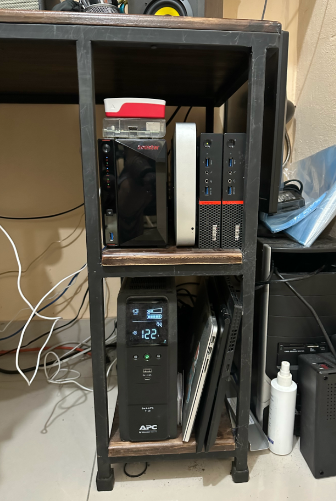
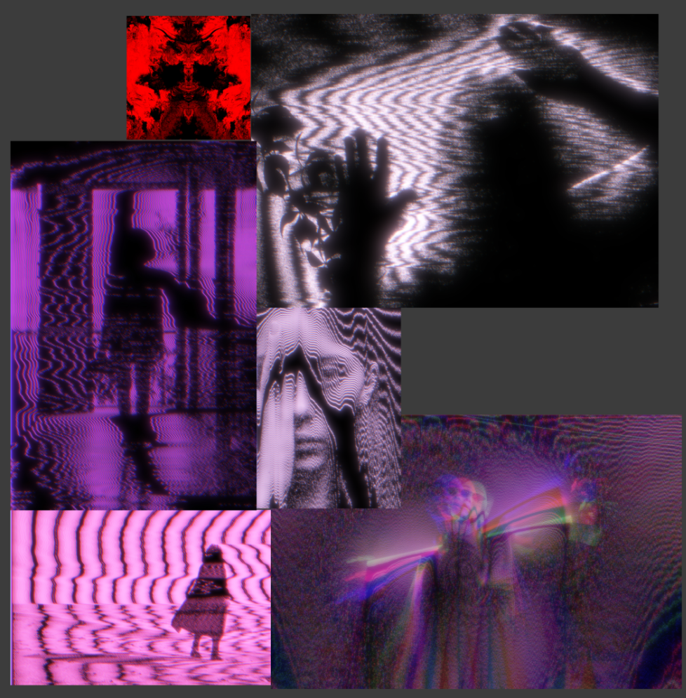
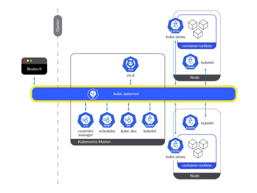
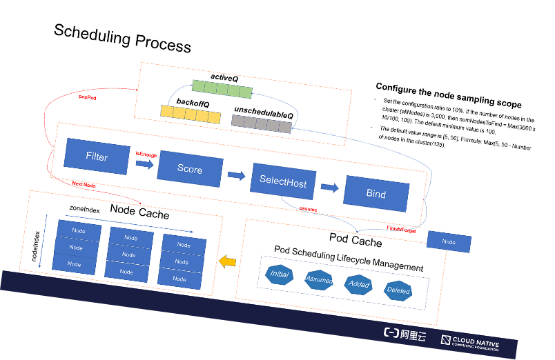
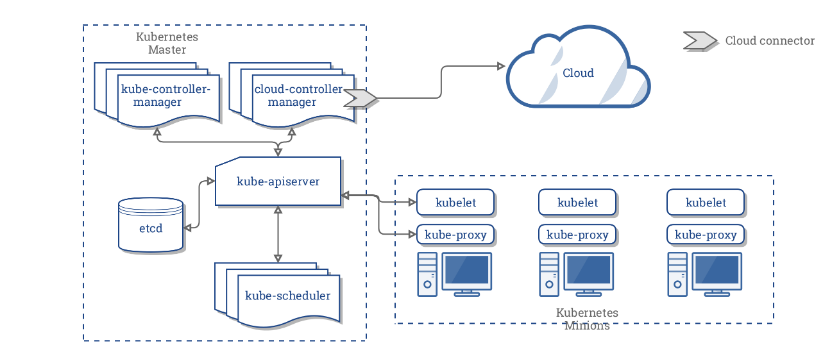
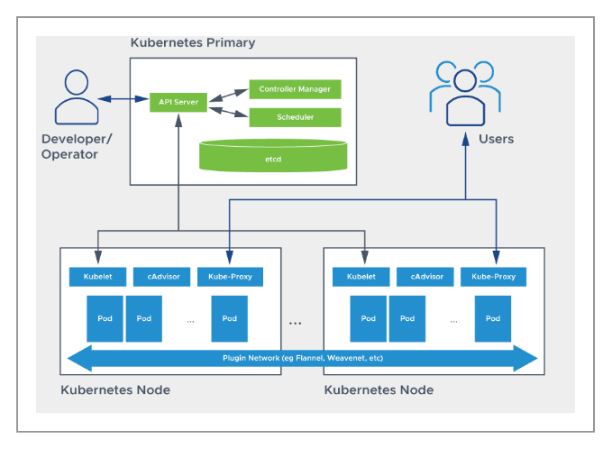

# Francisco Sanabria

<!-- incremental_lists: false -->

- 10 años de experiencia
- IBM: Cloud Engineer
- Datasite: Site Reliability Engineer
- Opensource ❤️
- Professional Nerd
  - Homelab
  - Visual Artist

### Contacto

- linkedin.com/in/fcosanabria
- github.com/fcosanabria
- instagram.com/digital.death.disrupt

<!-- end_slide -->

- Thinkclient M900
- Mac Mini 2012
- Asustor NAS
- RaspberryPi x2

<!-- end_slide -->

<!-- end_slide -->

# Recursos

- Ghostty Terminal + iTerm for gif support
- Neovim + Kickstart + LazyVim
- Tmux
- Berkeley Mono
- Presenterm
- Mermaid CLI

<!-- pause -->

> Todo esto puede encontrarse en mis dotfiles repo.
>
> github.com/fcosanabria/dotfiles.git

<!-- end_slide -->

# SRE: Site Reliability Engineering

- Observalibity
- Infrastructure
- Provide Tools
- Helps people

<!-- end_slide -->

# The Revolution of the Cloud

Hay una revolución que está sucediendo ahora mismo

- Creación de la nube
- El nacimiento de DevOps
- La creación de los contenedores

> Estas olas están creando un nuevo mundo de Software

<!-- speaker_note: El sistema operativo de nuestro nuevo mundo es Kubernetes -->
<!-- end_slide -->

# Historia

- Tour de historia rápido
- ¿Porqué Kubernetes es tan valioso?

<!-- speaker_note: |
  Kelsey Hightower es una leyenda en la comunidad de Kubernetes y ademas staff developer
  en Google, dice que Kubernetes provee absolutamente todo lo que un administrador de
  sistemas necesita para trabajar.
  - Automatizacion
  - Monitoreo
  - Sistemas de Contingencia
  - Logs centralizados y mucho más.
  > Es basicamente todo lo que la comunidad de DevOps ha aprendido durante todos estos años.
  > Y hacerlo por defecto listo para su uso.
-->
<!-- end_slide -->

# CLOUD NATIVE

## Nativo de la nube

- Automatizable
- Ubicuo y Flexible
- Resiliente y Escalable
- Dinámico
- Observable
- Distribuido

<!-- speaker_note: |
Ubicuo, es basicamente omnipresente.
Pronto vamos a entender esta parte, precisamente gracias a los conceptos
-->
<!-- end_slide -->

# Deployments

## Tradicional vs Contenedores vs Kubernetes

### Tradicional

```mermaid +render
graph TD
    subgraph "Traditional Deployments"
        A[Application] --> B[OS and Tools]
        B --> C[Hypervisor]
        C --> D[Metal]

        subgraph "Virtual Machines"
            VM1[VM] --> OS1(Linux)
            VM2[VM] --> OS2(Windows)
        end

        VM1 --- C
        VM2 --- C

        style A fill:#8B4513,stroke:#333,stroke-width:2px,color:#fff
        style B fill:#2F4F4F,stroke:#333,stroke-width:2px,color:#fff
        style C fill:#8B0000,stroke:#333,stroke-width:2px,color:#fff
        style D fill:#191970,stroke:#333,stroke-width:2px,color:#fff

        subgraph "Components"
            E[Operating System]
            F[Hypervisor]
            G[Utility Tools]
            H[Desktop Environment]
        end
    end
```

<!-- end_slide -->

# Deployments

## Contenedores

```mermaid +render
graph TD
    subgraph "Containers Architecture"
        A[App A] --> A_libs[libs]
        B[App B] --> B_libs[libs]
        C[App C] --> C_libs[libs]

        subgraph "Container Engine"
            CE(Container Engine)
        end

        A_libs --> CE
        B_libs --> CE
        C_libs --> CE

        OS[Host OS] --> Infra[Infrastructure]
        CE --> OS

        subgraph "Operations"
            Op1[Create]
            Op2[Manage]
            Op3[Run]
        end

        CE --- Op1
        CE --- Op2
        CE --- Op3

        style A fill:#4B0082,stroke:#333,stroke-width:2px,color:#fff
        style B fill:#4B0082,stroke:#333,stroke-width:2px,color:#fff
        style C fill:#4B0082,stroke:#333,stroke-width:2px,color:#fff
        style A_libs fill:#FF0000,stroke:#333,stroke-width:1px,color:#fff
        style B_libs fill:#FF0000,stroke:#333,stroke-width:1px,color:#fff
        style C_libs fill:#FF0000,stroke:#333,stroke-width:1px,color:#fff
        style CE fill:#228B22,stroke:#333,stroke-width:2px,color:#fff
        style OS fill:#8B0000,stroke:#333,stroke-width:2px,color:#fff
        style Infra fill:#191970,stroke:#333,stroke-width:2px,color:#fff
    end
```

<!-- end_slide -->

<!-- jump_to_middle -->
<!-- alignment: center -->

¡Todo se trata de imágenes!

<!-- end_slide -->

# Deployments + ¿porqué?

```mermaid +render
graph TD
    subgraph "Containers Architecture"
        subgraph "Node A"
            C1A( ):::container
            C2A( ):::container
            C3A( ):::container
            C4A( ):::container
        end

        subgraph "Node B"
            C1B( ):::container
            C2B( ):::container
            C3B( ):::container
            C4B( ):::container
        end
    end

    classDef container fill:#4B0082,stroke:#fff,stroke-width:1px,rx:5px,ry:5px;
```

<!-- end_slide -->

# Enfoque con Contenedores

```mermaid +render
graph TD
    subgraph "Container ONLY approach"
        subgraph "Node A"
            C1A( ):::container
            C2A( ):::container
            C3A( ):::container
            C4A( ):::container
        end

        subgraph "Node B"
            C1B( ):::container
            C2B( ):::container
            C3B( ):::container
            C4B( ):::container
        end

        C4A ---|Container 1<br>172.17.32.1| IP_A[ ]
        C1B ---|Container 1<br>172.17.32.1| IP_B[ ]

        style C1A fill:#4B0082,stroke:#fff,stroke-width:1px,rx:5px,ry:5px;
        style C2A fill:#4B0082,stroke:#fff,stroke-width:1px,rx:5px,ry:5px;
        style C3A fill:#4B0082,stroke:#fff,stroke-width:1px,rx:5px,ry:5px;
        style C4A fill:#4B0082,stroke:#fff,stroke-width:1px,rx:5px,ry:5px;
        style C1B fill:#4B0082,stroke:#fff,stroke-width:1px,rx:5px,ry:5px;
        style C2B fill:#4B0082,stroke:#fff,stroke-width:1px,rx:5px,ry:5px;
        style C3B fill:#4B0082,stroke:#fff,stroke-width:1px,rx:5px,ry:5px;
        style C4B fill:#4B0082,stroke:#fff,stroke-width:1px,rx:5px,ry:5px;

        style IP_A fill:#D3D3D3,stroke:#333,stroke-width:1px,color:#000
        style IP_B fill:#FFA500,stroke:#333,stroke-width:1px,color:#000

            end
```

## Limitations

- Los contenedores no se pueden comunicar por defecto
- Los nodos no estan conscientes de las IPs
- Comparten las IPs del mismo host
- Las IPs se pueden romper

<!-- speaker_note: |
Docker:
Containers on Node 1 cannot communicate with containers on Node 2
So it means that in the network it means that are the same item, so it will return localhost, for example.
All the containers on a node share the host IP space and must coordinate which ports they use on that node.
Esto significa que ambos contenedores no pueden tener el mismo port. Tienen que cambiar.
If a containers must be replaced, it will require a new ip address and any hard-coded IP addresses will break.
So... what are the problems that Kubernetes solves?
-->

<!-- end_slide -->

# Enfoque Kubernetes

```mermaid +render
graph TD
    subgraph "Kubernetes"
        subgraph "Master Node"
            Network[Network]:::component
            Etcd[Etcd]:::component
            Kubelet[Kubelet]:::component

            Network --- Etcd
            Etcd --- Kubelet
        end

        subgraph "Node A"
            subgraph "Pod 1"
                C1A( ):::container_orange
                C2A( ):::container_orange
            end
            subgraph "Pod 2"
                C3A( ):::container_red
                C4A( ):::container_red
            end
        end

        subgraph "Node B"
            C1B( ):::container
            C2B( ):::container
            C3B( ):::container
            C4B( ):::container
            C5B( ):::container_small
            C6B( ):::container_small

            subgraph "Pod 3"
                C7B( ):::container_blue
                C8B( ):::container_blue
            end
        end

        Master_Node_Label[Master Node]

        Master_Node_Label --- Node_A_Label[Node A]
        Master_Node_Label --- Node_B_Label[Node B]

        classDef component fill:#191970,stroke:#fff,stroke-width:1px,rx:5px,ry:5px,color:#fff;
        classDef container fill:#4B0082,stroke:#fff,stroke-width:1px,rx:5px,ry:5px;
        classDef container_orange fill:#4B0082,stroke:#FFA500,stroke-width:2px,rx:5px,ry:5px;
        classDef container_red fill:#4B0082,stroke:#8B0000,stroke-width:2px,rx:5px,ry:5px;
        classDef container_blue fill:#4B0082,stroke:#1E90FF,stroke-width:2px,rx:5px,ry:5px;
        classDef container_small fill:#4B0082,stroke:#fff,stroke-width:1px,rx:3px,ry:3px,width:30px,height:30px;
    end
```

- All containers can communicate with all other containers
- All nodes can communicate with all other containers
- They share the same IP Space

And the reason why that can happen is because...

<!-- end_slide -->

# Arquitectura de Kubernetes

- Master Node o Control Plane
- Worker Node

<!-- end_slide -->

# Control Plane

## Elements of the control plane in Kubernetes.

- Kube-apiserver

<!-- end_slide -->

# Control Plane

## Elements of the control plane in Kubernetes.

- Kube-apiserver
- Etcd

<!-- end_slide -->

# Control Plane

## Elements of the control plane in Kubernetes.

- Kube-apiserver
- Etcd
- Kube-scheduler

<!-- end_slide -->

# Control Plane

## Elements of the control plane in Kubernetes.

- Kube-apiserver
- Etcd
- Kube-scheduler
- Cloud-controller-manager

<!-- end_slide -->

# Control Plane

## Elements of the control plane in Kubernetes.

- Kube-apiserver
- Etcd
- Kube-scheduler
- Cloud-controller-manager
- Node components

<!-- end_slide -->

# Control Plane

- Es el cerebro del cluster
- Su trabajo es repartir a los contenedores
- Maneja los servicios
- Se encarga de servir los API request

Normalmente, en un ambiente profesional a larga escala,
no tenemos que preocuparnos por estos componentes, ya que
se usa los Managed Kubernetes Clusters o Clústeres de Kubernetes
Gestionados.

<!-- end_slide -->

# Worker Nodes

## Cluster members that can run user workloads

- Kubelet
- Kube-proxy
- Container Runtime

Kubelet is the main Kubernetes agent

- It handles all the communications with the cluster
- If a task won’t run, the kubelet reports the problem to the API server.
- And lets the control plane decide what actions to take.

<!-- end_slide -->

# Kubernetes flavors

## Open Source

- Kubernetes
- Minikube
- Rancher
- Openshift Origin
- Talos Linux

## Cloud Managed

- Google Kubernetes Engine
- Azure Kubernetes Service
- Amazon Elastic Kubernetes Service
- IBM Managed Kubernetes Service

## Enterprise

- RedHat Openshift
- Tanzu Kubernetes Grid
- Mirantis
- Elastisys Compliant Kubernetes
- Talos Linux Omni

<!-- end_slide -->

